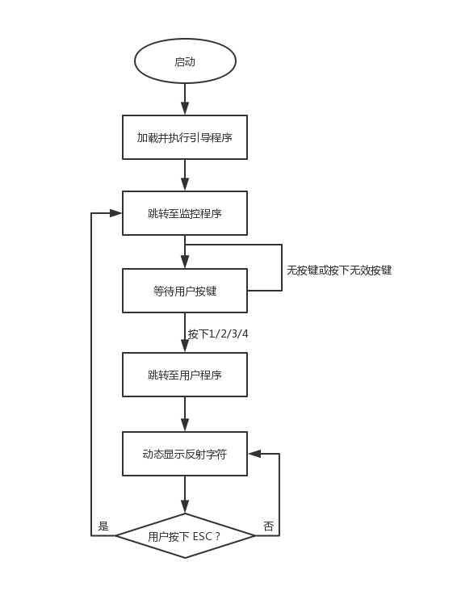
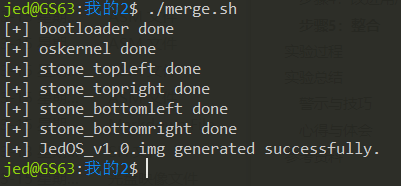
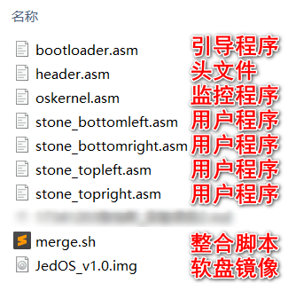
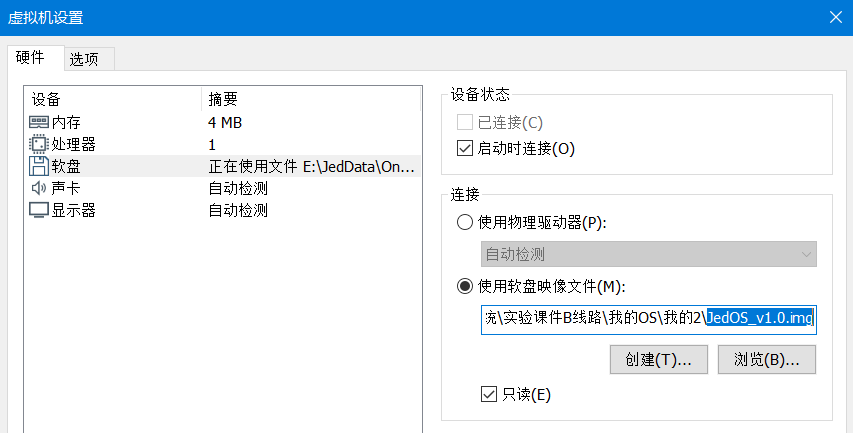
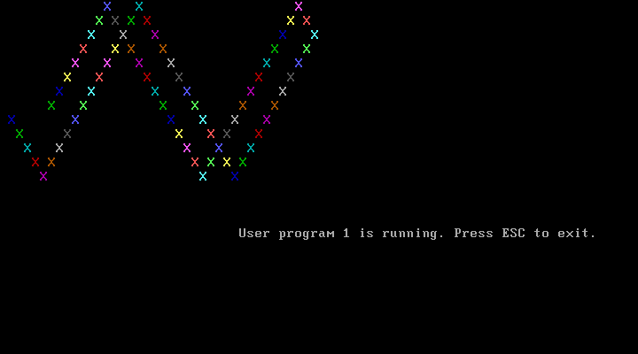
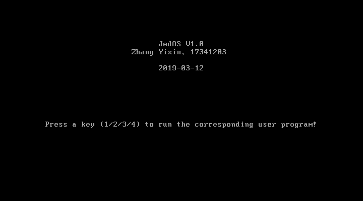
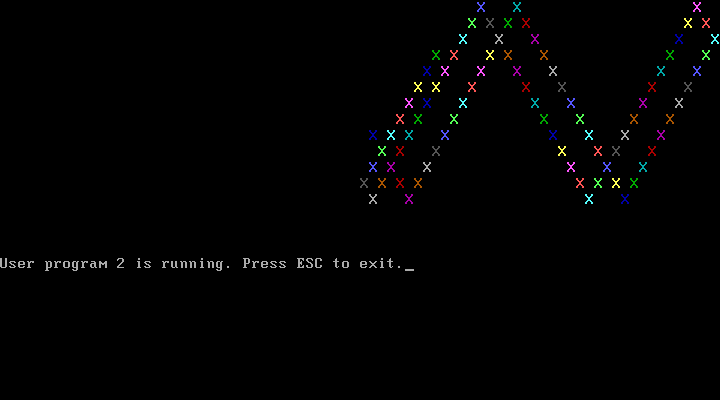
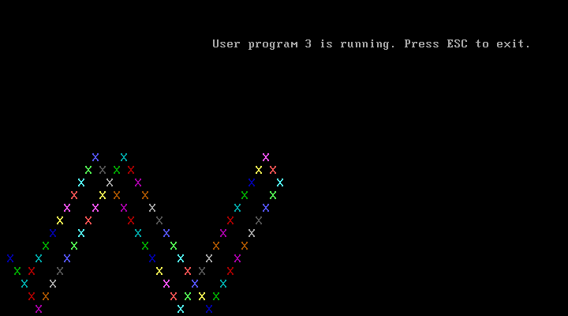

# 实验项目2：加载用户程序的监控程序


## 实验题目

加载用户程序的监控程序


## 实验目的

* 学习按引导扇区程序要求设计程序；
* 显示必要的提示信息后，从引导盘的特定扇区加载一个他人开发的COM格式的可执行程序到指定的内存位置，然后启动这个程序，实现操作系统执行用户程序这一项基本功能；
* 学习利用BIOS调用显示字符串和读磁盘扇区加载用户程序；
* 学习BIOS的10H和13H号调用。


## 实验要求

### 设计四个（或更多）有输出的用户可执行程序
设计四个有输出的用户可执行程序，分别在屏幕 1/4 区域动态输出字符，如将用字符‘A’从屏幕左边某行位置45度角下斜射出，保持一个可观察的适当速度直线运动，碰到屏幕相应1/4区域的边后产生反射，改变方向运动，如此类推，不断运动；在此基础上，增加你的个性扩展，如同时控制两个运动的轨迹，或炫酷动态变色，个性画面，如此等等，自由不限。还要在屏幕某个区域特别的方式显示你的学号姓名等个人信息。

修改参考原型代码，允许键盘输入，用于指定运行这四个有输出的用户可执行程序之一，要确保系统执行代码不超过512字节，以便放在引导扇区。

自行组织映像盘的空间存放四个用户可执行程序。


## 实验方案

包括：硬件或虚拟机配置方法、软件工具与作用、方案的思想、相关原理、程序流程、算法和数据结构、程序关键模块，结合代码与程序中的位置位置进行解释。

**实验中用到的工具列表**

- 操作系统：Windows 10
- 虚拟机软件：VMware Workstation 15 Pro
- 代码编辑器：Visual Studio Code 1.32.1
- 二进制文件编辑器：WinHex 14.2
- 终端：cmder v1.3.11
- Linux 环境：WSL Ubuntu, 4.4.0-17763-Microsoft
- 汇编编译器：NASM 2.11.08 (On Linux)


**优化开发环境**

* 使用 WSL，方便在 Windows 下进行代码编辑，然后在 Linux 下进行编译整合，最后在 VMware 中运行镜像。因为 WSL 可以直接访问主机的文件系统，因此这种方式使得文件互通没有阻碍。

* 由于本次实验涉及到多个文件的编译、整合，因此考虑使用 **shell 脚本**来使这个工作自动化进行。
* 将汇编程序中大量重复使用的代码（如显示字符串的代码）编写成**宏**，并放到头文件`header.asm`中。


### 确定实验所需步骤

本次实验项目内容较为复杂，需要先拆分为若干个步骤逐个击破。

1. **设计四个独立的用户程序**。这些用户程序的功能相似，分别是在屏幕的左上、右上、左下、右下区域动态反射输出字符，效果与实验项目1类似。设计出的四个用户程序需要能够分别在虚拟机上正确运行。

2. **设计引导程序**。引导程序的功能是引导监控程序（即操作系统），还要负责把四个用户程序装载进内存。

3. **设计监控程序**。监控程序即操作系统内核。本实验中，监控程序负责接受用户的键盘动作，然后跳转到相应的用户程序去执行。

   > 事实上，在本次实验中，引导程序和监控程序完全可以合成一个程序。不过，本着模块化思想，同时也为了方便后续的功能扩展，我还是决定将其与引导程序分开来。

4. **改进用户程序**。在第1步完成的“四个独立的用户程序”的基础上，添加监测用户键盘动作的功能，使得当用户按下按键时，退出用户程序并返回到监控程序。此外，还要添加清屏、显示字符串等额外功能。

5. **整合**。分别编译以上6个程序，然后将其整合到一起。最终，只需要1个`.img`文件作为虚拟软盘镜像。


### 设计出程序的执行流程

首先明确6个程序的文件名及其要实现的功能。

| 程序类别  | 文件名                | 功能                                             |
| --------- | --------------------- | ------------------------------------------------ |
| 引导程序  | bootloader.asm        | 加载监控程序和用户程序，然后跳转到监控程序执行。 |
| 监控程序  | oskernel.asm          | 接受用户按键，跳转到相应的用户程序去执行。       |
| 用户程序1 | stone_topleft.asm     | 在左上角动态反射输出字符。                       |
| 用户程序2 | stone_topright.asm    | 在右上角动态反射输出字符。                       |
| 用户程序3 | stone_bottomleft.asm  | 在左下角动态反射输出字符。                       |
| 用户程序4 | stone_bottomright.asm | 在右下角动态反射输出字符。                       |

各程序执行的流程图：




### 步骤1：设计四个独立的用户程序

用户程序的文件名是四个以`stone_`开头的 asm 文件。

1. 四个用户程序的功能非常相似，都是字符反射，区别是在屏幕的四个区域反射，因此考虑在`实验项目1`的代码上进行修改来达到目的。经过研究代码，我提取出程序中**控制字符运动位置的6个重要参数**，并把这6个参数以宏的形式表示出来，放在用户程序源码的靠近开头的位置，便于修改。宏名及其含义如下表所示：

   | 宏名          | 含义             |
   | ------------- | ---------------- |
   | screen_left   | 字符运动的左边界 |
   | screen_top    | 字符运动的上边界 |
   | screen_right  | 字符运动的右边界 |
   | screen_bottom | 字符运动的下边界 |
   | originpos_y   | 字符起点的列数   |
   | originpos_x   | 字符起点的行数   |

   在用户程序中，这些参数是这样定义的（仅以`stone_topleft.asm`为例）：

   ```assembly
   screen_left equ -1     ; 字符运动左边界
   screen_top equ -1      ; 字符运动上边界
   screen_right equ 40    ; 字符运动右边界
   screen_bottom equ 13   ; 字符运动下边界
   originpos_y equ 0      ; 起点列数
   originpos_x equ 7      ; 起点行数
   ```

   

2. 通过限定以上参数为合适的值，就可以使字符运动在屏幕的四个区域进行了。因此，可以十分方便地完成四个用户程序。经过计算和测试，得到可用的参数如下表所示：

   | 程序名                 | 运动区域 | 参数（按上表顺序）       |
   | ---------------------- | -------- | ------------------------ |
   | jed_stone.asm（项目1） | 整个屏幕 | (-1, -1, 80, 25, 0, 7)   |
   | stone_topleft.asm      | 左上角 ↖ | (-1, -1, 40, 13, 0, 7)   |
   | stone_topright.asm     | 右上角 ↗ | (39, -1, 80, 13, 40, 7)  |
   | stone_bottomleft.asm   | 左下角 ↙ | (-1, 11, 40, 25, 0, 19)  |
   | stone_bottomright.asm  | 右下角 ↘ | (39, 11, 80, 25, 40, 19) |

3. 分别编译四个用户程序。

   ```assembly
   nasm stone_topleft.asm -o stone_topleft.img
   nasm stone_topright.asm -o stone_topright.img
   nasm stone_bottomleft.asm -o stone_bottomleft.img
   nasm stone_bottomright.asm -o stone_bottomright.img
   ```

4. 分别测试四个用户程序。依次把用户程序的 img 文件加载至 VMware，作为软盘镜像，一个一个地测试用户程序，确保它们可以分别运行。测试结果如下：

   * stone_topleft.img

     

     

   * stone_topright.img

     

     

   * stone_bottomleft.img

     

     

   * stone_bottomright.img

     

     

5. 用`WinHex`打开任意一个编译生成用户程序的 img 文件，观察发现文件的大小已经非常接近 512 字节了。**由于后续还要在其中添加更多功能，因此考虑将此程序扩充至 1024 字节**，也就是用 2 个扇区去储存它。

   这里要做的修改参见“步骤4”的第4小步。

   

### 步骤2：设计引导程序

引导程序主要需要完成3个工作。**第一，显示提示信息**，表示系统正在启动（事实上，由于系统启动非常快，该信息几乎是一闪而过）；**第二，加载监控程序和用户程序到内存中**；**第三，跳转到监控程序执行**。

引导程序的文件名是`bootloader.asm`。

1. **显示提示信息**。在本次实验的课堂上，我学到了使用 BIOS 的 `int 10h`调用，其中有一个功能可以完成显示一行字符串的功能。代码如下，每个寄存器的内容在注释中都有体现：

   ```assembly
   mov	bp, Message            ; BP=当前串的偏移地址
   mov	ax, ds                 ; ES:BP = 串地址
   mov	es, ax                 ; 置ES=DS
   mov	cx, msglen             ; CX = 串长（=9）
   mov	ax, 1301h              ; AH = 13h（功能号）、AL = 01h（光标置于串尾）
   mov	bx, 0007h              ; 页号为0(BH = 0) 黑底白字(BL = 07h)
   mov dh, 0                  ; 行号=0
   mov	dl, 0                  ; 列号=0
   int	10h                    ; BIOS的10h功能：显示一行字符
   ```

   要显示的字符串储存在内存中：

   ```assembly
   Message db 'Bootloader is loading operating system and user programmes...'
   msglen equ ($-Message)
   ```

   

2. **加载监控程序和用户程序到内存中**。监控程序和用户程序本来存储在外存（虚拟软盘）中，可以通过 BIOS 的`int 13h`来读磁盘。示例代码：

   ```assembly
   LoadUsrProg1:
       mov ax,cs                  ; 段地址 ; 存放数据的内存基地址
       mov es,ax                  ; 设置段地址（不能直接mov es,段地址）
       mov bx, offset_usrprog1    ; 偏移地址; 存放数据的内存偏移地址
       mov ah,2                   ; 功能号
       mov al,2                   ; 扇区数
       mov dl,0                   ; 驱动器号 ; 软盘为0，硬盘和U盘为80H
       mov dh,0                   ; 磁头号 ; 起始编号为0
       mov ch,0                   ; 柱面号 ; 起始编号为0
       mov cl,3                   ; 起始扇区号 ; 起始编号为1
       int 13H                    ; 调用读磁盘BIOS的13h功能
   ```

   以上代码的功能是，从**3号扇区**开始读**2个扇区**的大小（1024字节），将其放入内存地址`offset_usrprog1`的位置（这是一个宏，定义在`header.asm`中）。加载4个用户程序和监控程序的代码与之类似，见`bootloader.asm`文件，里面有详细的注释。

3. **跳转到监控程序执行**。使用无条件转移指令即可：

   ```assembly
   EnterOs:
       jmp offset_oskernel        ; 跳转到操作系统内核执行
   ```

4. **0x55 0xAA**。在引导程序的末尾，需要使扇区的最后两个字节为`0x55 0xAA`从而成为有效主引导记录。使用与实验项目1中相同的方法：

   ```assembly
   SectorEnding:
       times 510-($-$$) db 0
       db 0x55,0xaa
   ```

   

### 步骤3：设计监控程序

监控程序需要在屏幕上提示用户按下键盘，还要处理键盘动作以跳转到相应的用户程序去执行。

监控程序的文件名是`oskernel.asm`。

1. **显示提示信息**。由于本实验项目中有很多情况都要用到在屏幕的某一位置显示字符串这一功能，因此我把显示字符串的代码块写成了一个宏`PRINT_IN_POS`，并放在`header.asm`中：

   ```assembly
   ; 用于在指定位置显示字符串，参数：(字符串首地址, 字符串字节数, 行数, 列数)
   %macro PRINT_IN_POS 4
       pusha            ; 保护现场
       mov	ax, cs       ; 置其他段寄存器值与CS相同
       mov	ds, ax       ; 数据段
       mov	bp, %1       ; BP=当前串的偏移地址
       mov	ax, ds       ; ES:BP = 串地址
       mov	es, ax       ; 置ES=DS
       mov	cx, %2       ; CX = 串长（=9）
       mov	ax, 1301h    ; AH = 13h（功能号）、AL = 01h（光标置于串尾）
       mov	bx, 0007h    ; 页号为0(BH = 0) 黑底白字(BL = 07h)
       mov dh, %3       ; 行号=0
       mov	dl, %4       ; 列号=0
       int	10h          ; BIOS的10h功能：显示一行字符
       popa             ; 恢复现场
   %endmacro
   ```

   在我设计的监控程序中，首先调用清屏函数，然后才能在不同的位置显示字符串。

   清屏函数通过 BIOS 调用实现：

   ```assembly
   ClearScreen:         ; 函数：清屏
       pusha
       mov ax, 0003h
       int 10h          ; 中断调用，清屏
       popa
       ret
   ```

2. 经查阅资料得知，键盘对应`int 16h`中断。当功能号`ah=0`时，系统（阻塞地）循环等待键盘按下，并把按键的 ASCII 码存在`al`寄存器中。

   我设计的功能是，用户按下1则跳转到用户程序1（左上角），按下2则跳转到用户程序2（右上角），按下3则跳转到用户程序3（左下角），按下4则跳转到用户程序4（右下角）。

   ```assembly
   Keyboard:
       mov ah, 0; Bochs: 0000:a173
       int 16h
       cmp al, '1'; 按下1
       je offset_usrprog1   ; 执行用户程序1
       cmp al, '2'; 按下2
       je offset_usrprog2   ; 执行用户程序2
       cmp al, '3'; 按下3
       je offset_usrprog3   ; 执行用户程序3
       cmp al, '4'; 按下4
       je offset_usrprog4   ; 执行用户程序14
       jmp Keyboard; 无效按键，重新等待用户按键
   ```


### 步骤4：改进用户程序

用户程序必须能在某些条件下返回监控程序。此外，根据实验要求，还要为用户程序添加显示个人信息的功能。

1. **按下按键，返回监控程序**。在实验项目1中，已经知道了动态显示反射字符的核心功能在于标签`show`后面的内容，所以，考虑在这里加入检测用户按键并返回操作系统的功能。

   这里使用功能号`ah=01h`的`int 16h`功能调用，它的功能是查询键盘缓冲区，对键盘扫描但不等待，并设置ZF标志。接着使用功能号`ah=0`的`int 16h`调用，检查用户按了什么键并根据判断条件跳转，实现按下`ESC`键即返回监控程序的功能。

   ```assembly
       mov ah, 01h            ; 功能号：查询键盘缓冲区但不等待
       int 16h
       jz continue            ; 无键盘按下，继续
       mov ah, 0              ; 功能号：查询键盘输入
       int 16h
       cmp al, 27             ; 是否按下ESC
       je QuitUsrProg         ; 若按下ESC，退出用户程序
   continue:
       jmp loop1
       ...                    ;此处省略
   QuitUsrProg:
       jmp 0A100h             ; 退出用户程序，返回监控程序
   ```

2. **显示个人信息**。在标签`start`下使用`PRINT_IN_POS`宏即可。这里举其中一个用户程序的例子：

   ```assembly
   PRINT_IN_POS hint1, hint1len, 16, 30
   ```

   `hint1`是要显示的字符串的地址，`hin1len`是字符串的长度，`16`代表起始行数，`30`代表起始列数。对于其他用户程序，代码相似，只需调整合适的显示位置即可。

3. **在开头处初始化变量**。为了保证用户程序的独立性，必须在代码段开头初始化用户程序中用到的变量。用户程序可能会被多次执行，因此必须在每次进入用户程序时，相关存储器区域和寄存器的内容应该是确定的，而不是上次运行遗留下来的。这段代码很重要，而且非常容易遗漏。

   在标签`start`下进行初始化：

   ```assembly
   initialize:                ; 多次调用用户程序时，可保证初始值是相同的
       mov word[x], originpos_x
       mov word[y], originpos_y
       mov byte[curcolor], 80h
       mov byte[curcolor2], 01h
       mov word[count], delay
       mov word[dcount], ddelay
       mov byte[rdul], Dn_Rt  ; 向右下运动
   ```

4. **扩充1024字节**。此时，用户程序的机器码已经超过了512字节，必须用2个扇区储存一个用户程序，因此，程序结尾的代码要改成：

   ```assembly
   times 1022-($-$$) db 0 ; 填充0，一直到第1022字节
   db 55h, 0AAh           ; 扇区末尾两个字节为0x55和0xAA
   ```

5. **确定用户程序在内存中的位置**。规定把监控程序装在入`0x0A100`起的 512 个字节中，四个用户程序依次放在`0x0A300`、`0x0A700`、`0x0AB00`、`0x0AF00`，各占 1024 字节。

6. **测试改进后的用户程序**。将四个用户程序都做以上修改，然后分别编译为机器码并使用 VMware 测试，均可正常运行。

   这里不再放截图了，因为效果和后面“实验过程”栏目中的截图一样。


### 步骤5：整合

至此，我们一共有包括`header.asm`、`bootloader.asm`、`oskernel.asm`和4个用户程序，共7个`.asm`文件。逐一手动编译，手动用`WinHex`之类的工具整合机器码很不现实。因此我使用 Shell Script 来实现自动化部署。

```shell
#!/bin/bash

output_file="JedOS_v1.0.img"
asm_files=("bootloader" "oskernel" "stone_topleft" "stone_topright" "stone_bottomleft" "stone_bottomright")


rm -f ${output_file}

for asm_file in ${asm_files[@]}
do
	nasm ${asm_file}.asm -o ${asm_file}.img
    cat ${asm_file}.img >> "${output_file}"
    rm -f ${asm_file}.img
    echo "[+] ${asm_file} done"
done

echo "[+] ${output_file} generated successfully."
```

将以上代码保存为`merge.sh`。以上代码可以用 NASM 将`.asm`文件编译为机器码，然后用`cat`命令将它们整合成一个名为`JedOS_v1.0.img`的虚拟软盘镜像文件。

在 WSL 中运行以上脚本，生成软盘镜像文件。




此时，本项目目录中已经有了这些文件：




## 实验过程

包括：主要工具安装使用过程及截图结果、程序过程中的操作步骤、测试数据、输入及输出说明、遇到的问题及解决情况、关键功能或操作的截图结果。

1. 加载`JedOS_v1.0.img`到 VMware 中。

   

   

2. 开启虚拟机。如果反应够快的话，可以看到屏幕顶部一闪而过的一串字符，其内容是“Bootloader is loading operating system and user programmes...”，来自引导程序。不过很快这串字符就会因为监控程序中的清屏而消失，因此没有充足的时间截图。

3. 引导完成后，将自动跳转至监控程序，如图所示：

   

   

4. 根据提示，可以按下键盘上的1、2、3、4这四个按钮来跳转到相应的监控程序。此时，按下数字1，进入用户程序1。

   

   

5. 按下 ESC 键，立即返回监控程序页面。

   

   

6. 按下数字2，进入用户程序2：

   

   

7. 按下 ESC，返回监控程序。再按下数字3，进入用户程序3：

   

   

8. 按下 ESC，返回监控程序。再按下数字4，进入用户程序4：

   


## 实验总结

### 警示与技巧

1. 汇编程序中，可能在多个地方用到相同或相似的功能代码。此时，为了更简便地编程，可以使用**宏**或**函数**这两种方法来减少重复的代码。我的代码中，这两种方法都有使用。

   * **宏**：在实现“在屏幕的某一位置显示字符串”功能时，我使用了宏。

     ```assembly
     %macro PRINT_IN_POS 4
         pusha            ; 保护现场
         mov	ax, cs       ; 置其他段寄存器值与CS相同
         mov	ds, ax       ; 数据段
         mov	bp, %1       ; BP=当前串的偏移地址
         mov	ax, ds       ; ES:BP = 串地址
         mov	es, ax       ; 置ES=DS
         mov	cx, %2       ; CX = 串长（=9）
         mov	ax, 1301h    ; AH = 13h（功能号）、AL = 01h（光标置于串尾）
         mov	bx, 0007h    ; 页号为0(BH = 0) 黑底白字(BL = 07h)
         mov dh, %3       ; 行号=0
         mov	dl, %4       ; 列号=0
         int	10h          ; BIOS的10h功能：显示一行字符
         popa             ; 恢复现场
     %endmacro
     ```

     这段宏接受四个参数，依次是字符串首地址、字符串长度、显示在第几行，显示在第几列。我将这段宏放在`header.asm`文件中，需要用到它的时候，只需要包含该文件：

     ```assembly
     %include "header.asm"
     ```

   * **函数**：在实现“清屏”功能时，我使用了函数：

     ```assembly
     ClearScreen:         ; 函数：清屏
         pusha
         mov ax, 0003h
         int 10h          ; 中断调用，清屏
         popa
         ret
     ```

     需要清屏时，只需要一行指令：

     ```assembly
     call ClearScreen
     ```

2. 接受用户键盘动作时，至少有两种情况。一是阻塞的，而是非阻塞的。在监控程序中，需要等待用户按下某个按键，从而跳转到相应的用户程序，这时必须用阻塞的；在显示动画的过程中，一旦用户按下 ESC 就必须立即退出到监控程序徐，这时必须用非阻塞的。这两种情况都可以利用`int 16h`实现，前者功能号`ah=0`，后者功能号`ah=01h`。

3. 最开始编写用户程序的时候，我遇到了一个问题。首先从监控程序进入用户程序，然后退出，再次进入时，运动的字符会有奇怪的表现，如不从规定的起点开始运动。后面发现，出现这种情况的原因是，字符的状态是保存在内存中的，退出用户程序后，原先的内存内容并没有改变，因此后续再次进入用户程序时，依然用的是上次遗留下来的数据。这是非预期的。为了使每次进入用户程序时的状态相同，在`start`标签下增加了`initialize`标签，在这里使用许多`mov`指令将内存初始化一遍。再测试，正常。

   

### 心得与体会

此次实验，我最大的收获有两个——一是在汇编语言方面的：学习了如何使用函数、宏、头文件、`org`指令、`times`指令；二是在操作系统方面的：知道了什么是引导程序，了解了主引导记录扇区的结构，知道了如何利用 BIOS 功能从外存中加载内容到内存中等等。


## 参考资料

1. [键盘I/O中断调用（INT 16H）](https://blog.csdn.net/qq_37232329/article/details/79974123)