# 实验项目4：异步事件编程技术


## 实验题目

异步事件编程技术


## 实验目的

1. 学习中断机制知识，掌握中断处理程序设计的要求；
2. 设计时钟中断处理程序和键盘中断响应程序；
3. 扩展 MyOS，增加一个系统服务的实现；
4. 建立具有简单异步事件处理的原型操作系统。


## 实验要求

在实验三的基础上，进化你的原型操作系统，增加下列操作系统功能：

1. 操作系统工作期间，利用时钟中断，在屏幕 24 行 79 列位置轮流显示’|’、’/’和’\’，适当控制显示速度，以方便观察效果。
2. 编写键盘中断响应程序，用户程序运行时，键盘事件有事反应：当键盘有按键时，屏幕适当位置显示”OUCH! OUCH!”。
3. 在内核中，对 33 号、34 号、35 号和 36 号中断编写中断服务程序，程序服务是分别在屏幕1/4区域内显示一些个性化信息。再编写一个汇编语言的程序，利用 int 33、int 34、int 35 和 int 36 产生中断调用你这4个服务程序。


## 实验方案

### 特色与新功能

**实验中用到的工具列表**

- 物理机操作系统：Windows 10
- 虚拟机软件：VMware Workstation 15 Pro
- 代码编辑器：Visual Studio Code 1.32.3
- Linux 环境：WSL Ubuntu, 4.4.0-17763-Microsoft
- 汇编编译器：NASM 2.11.08 (On Linux)
- C 语言编译器：GCC 5.4.0
- 链接器：GNU ld 2.26.1


**本次更新 & 额外功能说明**

1. 完成“实验要求”中的所有内容；
2. 修复上一版本遗留的 bug（run 一个不存在的程序号导致系统崩溃），并重构或优化了部分内核代码，从而减小了内核体积；
3. 重新设计用户程序信息表（`usrproginfo.asm`）的结构，使用`db`以节约空间，还增加了用户程序存放的柱面号、磁头号等信息块；
4. **新增`date`这一 shell 命令，功能是查看当前日期和时间**；
5. **增加`hotwheel`这一 shell 命令，用来扩展实验要求1的功能。此命令的功能是控制“风火轮”的显示与关闭**；
6. **为实验要求3中的 int 33~36 设计了全新的动画效果，而不是使用原来的用户程序**；
7. **添加了在 shell 中显示彩色字符的功能**。


### 软盘扇区安排说明

我是按照这张表格来组织安排软盘中的内容的。注意扇区号从 1 开始。

| 磁头号 | 扇区号 | 扇区数（大小） | 内容                          |
| ------ | ------ | -------------- | ----------------------------- |
| 0      | 1      | 1（512 B）     | 引导程序                      |
| 0      | 2      | 1（512 B）     | 存放用户程序信息的表          |
| 0      | 3~18   | 16（8 KB）     | 操作系统内核                  |
| 1      | 1~2    | 2（1 KB）      | 用户程序1                     |
| 1      | 3~4    | 2（1 KB）      | 用户程序2                     |
| 1      | 5~6    | 2（1 KB）      | 用户程序3                     |
| 1      | 7~8    | 2（1 KB）      | 用户程序4                     |
| 1      | 9      | 1（512 B）     | **调用 int 33~36 的用户程序** |

这个表格在实验项目3的文档中已经展示过了，除了最后一行是本项目新增的。该用户程序的代码在`intcaller.asm`中，占用1个扇区，其作用是接收用户键盘输入并调用相应的中断，int 33、34、35或36。


### 内核概述

内核的文件名与实验项目3相比有所调整。内核的源代码在以下几个文件中，功能全部由本人独立完成：

| 文件名        | 名称   | 格式 | 内容简介                                                     |
| ------------- | ------ | ---- | ------------------------------------------------------------ |
| osstarter.asm | 内核   | ASM  | 显示操作系统信息，提示用户进入 shell                         |
| liba.asm      | 汇编库 | ASM  | 包含了若干使用汇编语言编写的函数，可供汇编或C程序调用        |
| kernel.c      | C 库   | C    | 包含了若干使用 C 语言编写的函数，可供汇编或C程序调用。还包含了一个 shell |
| stringio.h    | C 库   | C    | 被`libc.c`包含，内有涉及字符串、键盘输入、屏幕输出等功能的实现代码 |


JedOS v1.2 的 shell 支持的命令有：

| 命令         | 功能                                                         |
| ------------ | ------------------------------------------------------------ |
| help         | 显示shell基本信息和支持的命令及其功能                        |
| clear        | 清屏                                                         |
| list         | 显示可以运行的用户程序                                       |
| run          | 按顺序批量地执行用户程序，可以执行一个或多个程序，如`run 1`执行用户程序1；`run 1 2 3`依次执行用户程序1、用户程序2、用户程序3。 |
| poweroff     | 强制关机                                                     |
| **date**     | 显示当前日期和时间                                           |
| **hotwheel** | 显示或关闭风火轮                                             |


### 任务一、时钟中断：风火轮

源代码见`hotwheel.asm`。

系统时钟中断号为 08h，该中断由系统每隔一个固定的时间自动调用，因此我们只需要将中断处理程序写入中断向量表中 08h 号的位置即可。

中断处理程序要在屏幕右下角（第24行，第79列）的位置循环依次显示' -\\|/' 这四个字符。**基本思想**是，使用一个寄存器 si 来保存当前显示的字符是这四个字符中的第几个，然后每隔一段时间递增该寄存器，如果递增到4了就将其归零，如此循环往复。至于间隔的时间是多少，经过我的测试，发现将时间间隔设为“时钟中断被系统调用3次”的显示效果最好。

基于以上思想，就可以编写中断处理程序了。在中断处理程序中，首先检查`count`变量是否递减为 0，如果否，则立即中断返回，不做任何操作；如果是0，则递增 si，使其指向下一个要显示的字符，并更新显存。

关键代码：

```assembly
dec byte [count]            ; 递减计数变量
jnz EndInt                  ; >0：跳转
mov byte[count],delay       ; 重置计数变量=初值delay
mov si, hotwheel            ; 风火轮首字符地址
add si, [wheel_offset]      ; 风火轮字符偏移量
mov al, [si]                ; al=要显示的字符
mov ah, 0Ch                 ; ah=黑底，淡红色
mov [gs:((80*24+79)*2)], ax ; 更新显存
inc byte[wheel_offset]      ; 递增偏移量
cmp byte[wheel_offset], 4   ; 检查偏移量是否超过3
jne EndInt                  ; 没有超过，中断返回
mov byte[wheel_offset], 0   ; 超过3了，重置为0

... ; 涉及键盘检测的代码已经略去

mov ax, [end_row]         ; al=end_row，ah实际上无用
mov ah, 2*80
mul ah                    ; ax=end_row * 2 * 80
add ax, [start_row]       ; ax=start_row + end_row*2*80
cmp si, ax
jne disploop              ; 范围全部显示完，中断返回
```


该中断处理程序与内核一起编译，并在进入内核之初（`osstarter.asm`）将其写入中断向量表中即可。

由于本次实验项目中多次用到了写入中断向量表这一操作，因此我将其实现为宏，并放在`macro.asm`中：

```assembly
%macro WRITE_INT_VECTOR 2       ; 写中断向量表；参数：（中断号，中断处理程序地址）
    push ax
    push es
    mov ax, 0
    mov es, ax                  ; ES = 0
    mov word[es:%1*4], %2       ; 设置中断向量的偏移地址
    mov ax,cs
    mov word[es:%1*4+2], ax     ; 设置中断向量的段地址=CS
    pop es
    pop ax
%endmacro
```


在`osstarter.asm`中写入 08h 号中断向量：

```assembly
WRITE_INT_VECTOR 08h, Timer ; 装填时钟中断向量表
```


除此之外，我还为风火轮的显示与关闭添加了一个开关——shell 中的`hotwheel`命令，详见下文。


### 任务二、键盘中断：显示“OUCH!”

源代码在`usrprog/interrupt/intouch.asm`中。

首先要了解 PC 机对键盘的处理过程。当按下键盘时，系统引发 09h 号中断，在 BIOS 提供的中断处理程序中，首先从 60h 端口中读出按键扫描码，然后将其存入键盘缓冲区。而键盘缓冲区中的内容可以由 int 16h 读出并清除。（*详细内容见参考资料1*）

为了使在用户程序中按下键盘时能够显示“OUCH! OUCH!”字符串，我们需要手动编写 int 09h 的中断处理程序，在该程序中，需要在屏幕特定位置显示出“OUCH! OUCH!”，还要读入用户按下的字符，避免其堵塞在 60h 端口或残留在 BIOS 键盘缓冲区中。

一种比较好的方法是**在我们自己编写的中断例程中调用原来 BIOS 提供的中断处理程序**，要想这么做，需要先保存原来程序的地址，然后再把我们的程序写入中断向量表，并在我们的程序中调用原来的程序。进一步简化操作，我**将中断向量表中原来的 int 09h 处理程序的段地址和偏移量移动至 int 39h 处**，并在我自己的中断处理程序中调用`int 39h`即可。

转移中断向量的宏如下：

```assembly
%macro MOVE_INT_VECTOR 2        ; 将参数1的中断向量转移至参数2处
    push ax
    push es
    push si
    mov ax, 0
    mov es, ax
    mov si, [es:%1*4]
    mov [es:%2*4], si
    mov si, [es:%1*4+2]
    mov [es:%2*4+2], si
    pop si
    pop es
    pop ax
%endmacro
```


接下来编写中断处理程序`IntOuch`。

为了使我们能够看清显示的“OUCH! OUCH!”（避免其过快地消失），需要在显示字符串后延迟一段时间，然后再清除掉显示的字符串。显示字符串可以使用功能号 ah=13h 的 int 10h BIOS 功能调用。延迟函数`Delay`如下：

```assembly
Delay:                   ; 延迟一段时间
    push ax
    push cx
    mov ax, 580
delay_outer:
    mov cx, 50000
delay_inner:
    loop delay_inner
    dec ax
    cmp ax, 0
    jne delay_outer
    pop cx
    pop ax
    ret
```

由于`Delay`函数之在同一汇编程序内调用，因此无需使用远程调用，而是使用普通的`call`和`ret`来短程调用即可。


最后修改用户程序。需要在实验项目3中的那四个用户程序（左上、右上、左下、右下）开始处（Start 标签附近）转移中断向量，并写入中断向量表：

```assembly
MOVE_INT_VECTOR 09h, 39h
WRITE_INT_VECTOR 09h, IntOuch
```

在用户程序退出前（`retf`之前）恢复中断向量，不影响内核以及其他程序使用 BIOS 原生的 int 09h：

```assembly
QuitUsrProg:
    MOVE_INT_VECTOR 39h, 09h
```


### 任务三、33、34、35、36号中断

源代码在`usrprog/intcaller.asm`和`usrprog/interrupt/int33~36.asm`中。

`intcaller.asm`中存放的是与之前那四个用户程序并列的一个新用户程序，它的信息同样被写在用户程序信息表（`usrproginfo.asm`）中。这个用户程序首先将 33、34、35、36 号中断的处理程序写入中断向量表，然后检测用户键盘输入，当用户按下 3/4/5/6 时，分别执行`int 33`/`int 34`/`int 35`/`int 36`进入中断。


中断处理程序为本次实验项目新制作的简单动画效果：在屏幕的某些横向区域显示彩色滚动条，具体的区域范围由`start_row`和`end_row`确定。`start_row`和`end_row`是存储器变量，由`intcaller.asm`作为实参写入这两个变量，这样可以使不同的中断号再屏幕不同的位置显示滚动条。动画采用直接写入显存的方式实现，逻辑简单且效率高。源代码见`int33~36.asm`文件。

由于 33~36 这些中断号本来没有定义，因此无需进行保存、恢复操作。

关键代码：

```assembly
	mov ax,cs
    mov ds,ax                 ; DS = CS
    mov	ax,0B800h             ; 文本窗口显存起始地址
    mov	gs,ax                 ; GS = B800h
    mov ax, [start_row]       ; ax=start_row
    mov ah, 2*80              ; ah=2*80
    mul ah                    ; ax=start_row * 2 * 80
    mov si, ax                ; si初始化为起始位置指针
disploop:
    mov al, [temp_char]       ; 要显示的字符
    mov [gs:si], al           ; 显示字符
    inc si                    ; 递增指针
    mov ah, [temp_color]      ; 字符颜色属性
    mov [gs:si], ah           ; 显示颜色属性
    inc si                    ; 递增指针
    add byte[temp_color], 11h ; 改变颜色
    call Delay                ; 延时
```


### 新增功能、date：显示当前日期时间

该命令实现在内核中，作为一条 shell 内置命令。

在 PC 机中有一个 **CMOS RAM** 芯片，其中包含一个时钟，当前时间就存放在这里。年、约、日、时、分、秒这 6 个信息各占 1 个字节，以 **BCD 码**存放在 CMOS 中，存放单元依次为 0、2、4、7、8、9。要读取 CMOS 信息，**首先向 70h 端口写入要访问的单元地址，然后从 71h 端口读入数据**。

读取日期和时间的功能被实现为`liba.asm`中的 6 个函数，它们的全局声明如下：

```assembly
[global getDateYear]
[global getDateMonth]
[global getDateDay]
[global getDateHour]
[global getDateMinute]
[global getDateSecond]
```


以上六个函数定义颇为相似，此处仅给出`getDateYear`作为示例。该函数从 71h 端口读出单元 9 中的内容，将其存放在 ax 中作为返回值：

```assembly
getDateYear:                    ; 函数：从CMOS获取当前年份
    mov al, 9
    out 70h, al
    in al, 71h
    mov ah, 0
    retf
```


这些函数供内核中的 C 代码调用。与之对应的 C 函数原型如下：

```c
extern uint8_t getDateYear();
extern uint8_t getDateMonth();
extern uint8_t getDateDay();
extern uint8_t getDateHour();
extern uint8_t getDateMinute();
extern uint8_t getDateSecond();
```


需要注意的是，这些函数返回的是 **BCD 码**，需要一个将 BCD 码转换为十进制整数的函数：

```c
uint8_t bcd2decimal(uint8_t bcd)
{
    return ((bcd & 0xF0) >> 4) * 10 + (bcd & 0x0F);
}
```


在 shell 中添加`date`命令的支持：

```c
if(strcmp(cmd_firstword, commands[date]) == 0) {
    putchar('2'); putchar('0');
    print(itoa(bcd2decimal(getDateYear()), 10)); putchar('-');
    print(itoa(bcd2decimal(getDateMonth()), 10)); putchar('-');
    print(itoa(bcd2decimal(getDateDay()), 10)); putchar(' ');
    print(itoa(bcd2decimal(getDateHour()), 10)); putchar(':');
    print(itoa(bcd2decimal(getDateMinute()), 10)); putchar(':');
    print(itoa(bcd2decimal(getDateSecond()), 10));
    NEWLINE;
}
```


### 新增功能、hotwheel：显示或关闭风火轮

该命令实现在内核中，作为一条 shell 内置命令。

命令由汇编实现（`liba.asm`中）。首先判断 08h 号中断向量指向的是不是风火轮函数`Timer`的地址，如果是，则将其恢复为初始的中断处理程序；如果不是，则将其替换为风火轮中断处理程序，即`Timer`。

当然，为了增加这个功能，需要先将原本的 08h 号中断向量移动到 38h 去。将 `osstarter.asm`中的相关代码改为：

```assembly
MOVE_INT_VECTOR 08h, 38h
WRITE_INT_VECTOR 08h, Timer ; 装填时钟中断向量表
```


切换显示/关闭状态的代码如下：

```assembly
switchHotwheel:                 ; 函数：打开或关闭风火轮
    push es
    mov ax, 0
    mov es, ax
    mov ax, [es:08h*4]          ; ax=08h号中断处理程序的偏移地址
    cmp ax, Timer               ; 检查08h号中断处理程序是否是风火轮
    je turnoff                  ; 如果是，则关闭
    WRITE_INT_VECTOR 08h, Timer ; 如果不是，则打开
    mov ax, 1                   ; 返回1表示风火轮已打开
    jmp switchDone
    turnoff:
    MOVE_INT_VECTOR 38h, 08h
    mov	ax, 0B800h              ; 文本窗口显存起始地址
    mov	gs, ax                  ; GS = B800h
    mov ah, 0Fh                 ; 黑色背景
    mov al, ' '                 ; 显示空格
    mov [gs:((80*24+79)*2)], ax ; 更新显存
    mov ax, 0                   ; 返回0表示风火轮已关闭
    switchDone:
    pop es
    retf
```


该函数可以被 C 语言调用。每次调用`switchHotwheel()`，屏幕右下角的风火轮在显示、关闭这两种状态之间切换。


### 新增功能、显示彩色字符串

在内核的先前版本中，显示单个字符是通过功能号 ah=0Eh 的 int 10h 调用（电传打字机输出）实现的。该功能好处是能够自动移动光标到下一个字符的位置，坏处是不能改变字符颜色属性。

本次重新实现一个新的函数——`putchar_c`，即显示一个可调整颜色的字符，并移动光标到下一位置。`putchar_c`中主要做了两件事：

1. 使用 ah=03h 的 int 10h 以获取当前光标位置，并将行列保存在 dh 和 dl 中；
2. 使用 ah=13h 的 int 10h 显示字符串。令 cx=1 从而实现只打印一个字符，字符的地址从栈中取得，字符的颜色属性也从栈中取得。此功能可以使光标自动变化到下一个字符的位置，并能够自动换行、翻页。

该函数由 C 语言调用，函数原型如下：

```c
extern void putchar_c(char c, uint8_t color);
```


汇编定义如下：

```assembly
putchar_c:                        ; 函数：在光标处打印一个彩色字符
    pusha
    push ds
    push es
    mov bx, 0                   ; 页号=0
    mov ah, 03h                 ; 功能号：获取光标位置
    int 10h                     ; dh=行，dl=列
    mov ax, cs
    mov ds, ax                  ; ds = cs
    mov es, ax                  ; es = cs
    mov bp, sp
    add bp, 20+4                ; 参数地址，es:bp指向要显示的字符
    mov cx, 1                   ; 显示1个字符
    mov ax, 1301h               ; AH = 13h（功能号）、AL = 01h（光标置于串尾）
    mov bh, 0                   ; 页号
    mov bl, [bp+4]              ; 颜色属性
    int 10h                     ; 显示字符串（1个字符）
    pop es
    pop ds
    popa
    retf
```


为了兼容之前版本的`putchar`，现在 C 中重新定义`putchar`：

```c
/* 显示一个白色字符 */
void putchar(char c) {
    putchar_c(c, 0x07);
}
```


打印彩色字符串（多个字符）的 C 函数为：

```c
void print_c(const char* str, uint8_t color) {
    for(int i = 0, len = strlen(str); i < len; i++) {
        putchar_c(str[i], color);
    }
}
```


### 自动化部署（Shell 脚本）

使用 Shell Script 在 Linux 下进行编译、链接、整合。

```bash
#!/bin/bash
rm -rf temp
mkdir temp
rm *.img

nasm bootloader.asm -o ./temp/bootloader.bin
nasm usrproginfo.asm -o ./temp/usrproginfo.bin

cd usrprog
nasm stone_topleft.asm -o ../temp/stone_topleft.bin
nasm stone_topright.asm -o ../temp/stone_topright.bin
nasm stone_bottomleft.asm -o ../temp/stone_bottomleft.bin
nasm stone_bottomright.asm -o ../temp/stone_bottomright.bin
nasm intcaller.asm -o ../temp/intcaller.bin
cd ..

nasm -f elf32 hotwheel.asm -o ./temp/hotwheel.o

nasm -f elf32 osstarter.asm -o ./temp/osstarter.o
nasm -f elf32 liba.asm -o ./temp/liba.o
gcc -c -m16 -march=i386 -masm=intel -nostdlib -ffreestanding -mpreferred-stack-boundary=2 -lgcc -shared kernel.c -o ./temp/kernel.o
ld -m elf_i386 -N -Ttext 0x8000 --oformat binary ./temp/osstarter.o ./temp/liba.o ./temp/kernel.o ./temp/hotwheel.o -o ./temp/kernel.bin
rm ./temp/*.o

dd if=./temp/bootloader.bin of=JedOS_v1.2.img bs=512 count=1 2> /dev/null
dd if=./temp/usrproginfo.bin of=JedOS_v1.2.img bs=512 seek=1 count=1 2> /dev/null
dd if=./temp/kernel.bin of=JedOS_v1.2.img bs=512 seek=2 count=16 2> /dev/null
dd if=./temp/stone_topleft.bin of=JedOS_v1.2.img bs=512 seek=18 count=2 2> /dev/null
dd if=./temp/stone_topright.bin of=JedOS_v1.2.img bs=512 seek=20 count=2 2> /dev/null
dd if=./temp/stone_bottomleft.bin of=JedOS_v1.2.img bs=512 seek=22 count=2 2> /dev/null
dd if=./temp/stone_bottomright.bin of=JedOS_v1.2.img bs=512 seek=24 count=2 2> /dev/null
dd if=./temp/intcaller.bin of=JedOS_v1.2.img bs=512 seek=26 count=2 2> /dev/null


echo "[+] Done."
```


执行这个脚本，生成 JedOS_v1.2.img 镜像文件。


## 实验过程

启动虚拟机，引导程序自动加载操作系统，并进入内核，显示欢迎画面：


注意到**屏幕右下角的红色风火轮**已经显示并正常地旋转。

按下回车，进入 shell 界面。可以发现**提示符“JedOS #”变成了浅青色**，而用户输入的字符、其他显示的字符都是白色。右下角的风火轮依然正常旋转。

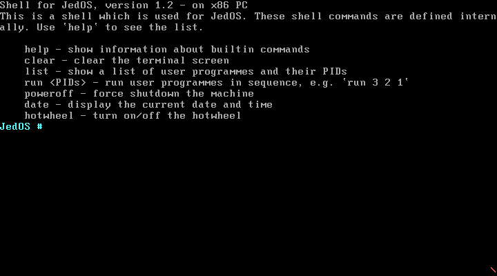


鉴于`help`、`clear`、`poweroff`命令已经在实验项目 3 中详细测试过了，而且在项目 4 中几乎没有修改这些命令的定义，因此这里就不再测试它们了。

输入`list`，看到新增了一个用户程序 5 “interrupt_caller”。与实验项目 3 中的`list`对比，可以看到用户程序信息表的纵列有所增加——现在不仅显示用户程序的 PID、名称、大小（字节数）、内存地址，还能显示它在软盘中的柱面号（Cylinder）、磁头号（Head）和扇区号（Sector）。如下图：

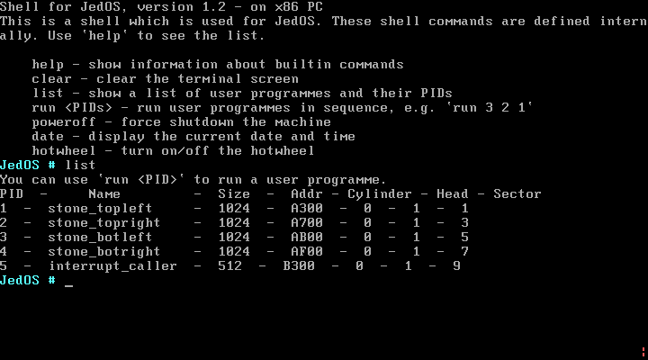


输入`date`命令，立即**显示当前的日期和时间**：

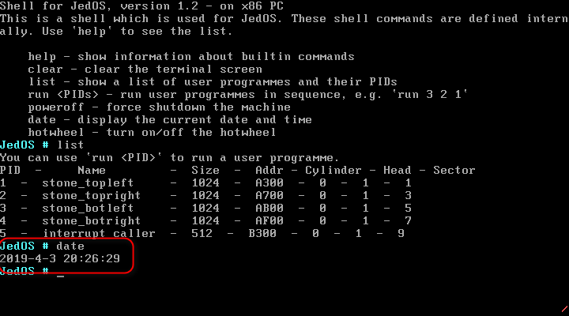


此前，屏幕右下角的风火轮一直在旋转。现在，我们输入`hotwheel`命令关闭它：

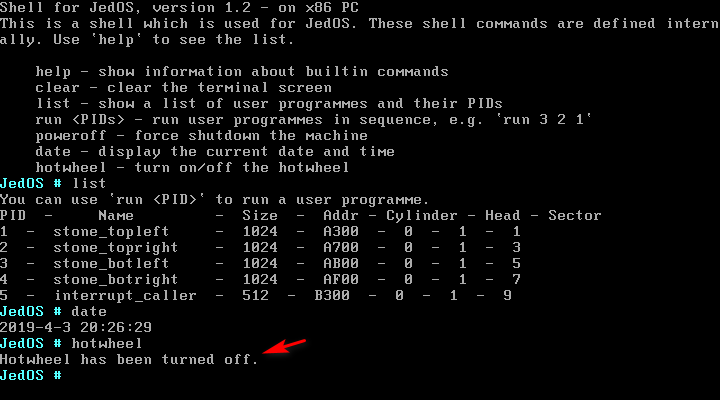


从上图中可以看到，右下角风火轮不再显示，同时屏幕上打印了一条提示信息：“Hotwheel has been turned off.”

再次输入`hotwheel`，发现右下角风火轮又显示了，同时屏幕上打印了一条提示信息：“Hotwheel has been turned on.” 如下图：

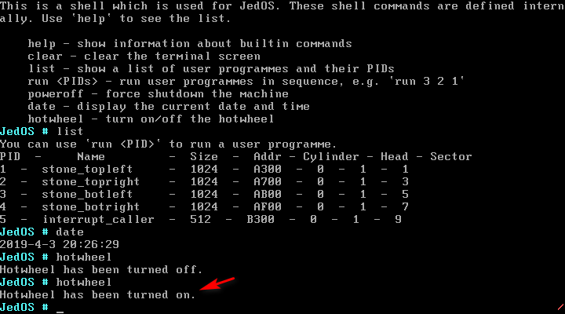


下面测试 int 33、34、35、36 的功能。首先，从之前执行`list`的结果来看，中断调用程序的序号（PID）为 5。因此，输入`run 5`进入 interrupt_caller：

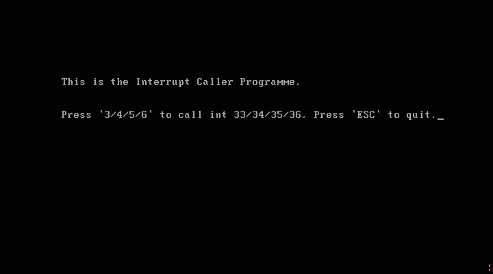


根据提示，我们可以按下键盘的 3/4/5/6 按键来分别调用 int 33、int 34、int 35 或 int 36。

按下 3 的效果是，彩色滚动条从第1行逐渐滚动第6行，动画截屏如下：

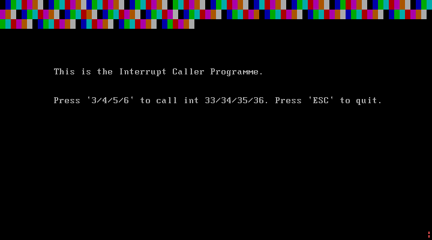


按下 4 的效果是，从第7行滚动到第12行，动画截屏：

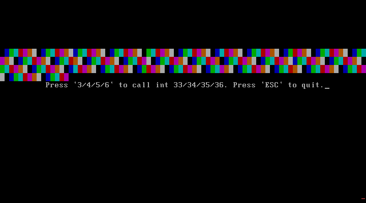


按下 5 的效果是，从第13行滚动到第18行，动画截屏：

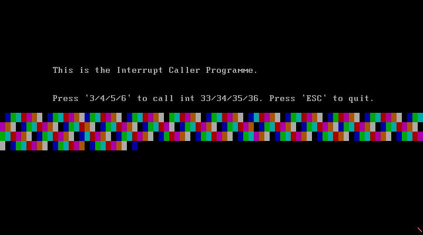


按下 6 的效果是，从第19行滚动到第25行，动画截屏：

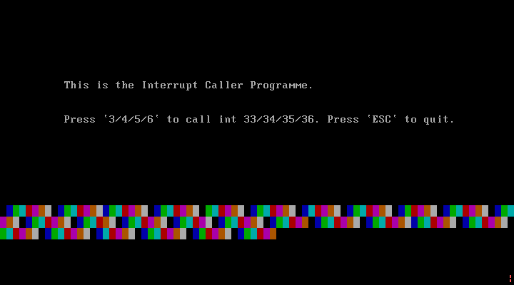


在以上过程中的任意时刻，只要用户按下 ESC，就会立即退出该程序，回到 shell：

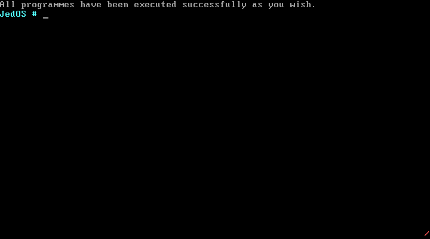


当然，若滚动条滚动完毕后，程序也会自动退出并回到 shell。

下面测试用户程序中显示“OUCH! OUCH!”的功能。在 shell 中输入`run 1234`以批处理方式依次执行用户程序1、2、3、4：

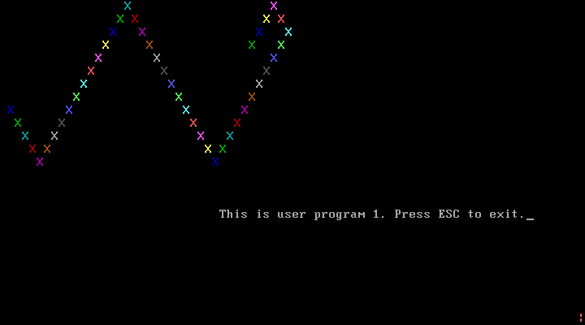


按下**除 ESC 以外的任意按键**，在屏幕右下部分显示“OUCH! OUCH!”（红色箭头所指）：

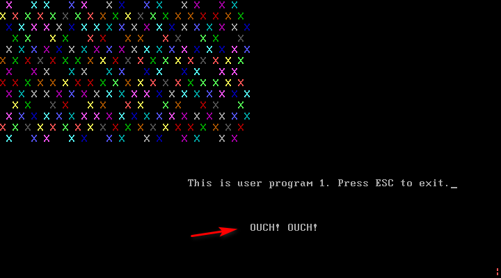


按下 ESC，退出用户程序1，进入用户程序2。在用户程序2中按下除 ESC 以外的任意按键，会在同样的位置显示“OUCH! OUCH!”。

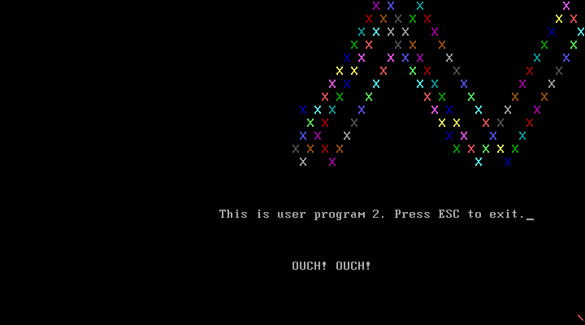


用户程序3、4的效果与之相同，不再截图。


## 实验总结

### 警示与技巧

1. **改写一个已存在的 BIOS 中断**。比如本次实验项目中的 int 09h，BIOS 中已经有对于此中断的处理程序，而我们的目的是在其基础上添加一些功能。我想到的一种方便的技巧就是，将原本存在的中断处理程序的地址移动到中断向量表中的一个“空闲”位置。比如在本项目中，我将中断向量表中 09h 号中断处理程序的段值和偏移量移动到了 39h 号的位置，然后用我自己的中断处理程序覆盖掉 09h。然后在我自己的中断处理程序中使用`int 39h`指令，实现了调用原本的 BIOS 09h 号中断。

2. **使用宏**。使用宏可以减小程序的冗余性，因为不需要在多个地方编写相同的代码了。将常用的代码“封装”成宏，并将所有的宏都放在同一个文件`macro.asm`中，在需要用到这些宏的地方`%include "macro.asm"`即可。再者，将过程写在宏中，方便调试和修改，因为只需修改`macro.asm`中的宏定义，即可起到修改所有用到该宏的代码，而不需要逐个地修改，既简便，又减少了出错的可能性。

3. **`pusha`指令并不能保护段寄存器**。`pusha`的作用是将通用寄存器压入堆栈，在 16 位机中，按照 ax、cx、dx、bx、sp（原始值）、bp、si、di 的顺序入栈。值得注意的是，`pusha`并不能保护 cs、ds、es、ss 等段寄存器。如果在函数中修改了这些段寄存器，则需要手动将被修改的段寄存器压栈和出栈。

4. **软盘的结构**。一个 3.5 英寸的 1.44 MB 的软盘由 80 个磁道、18 个扇区构成，而且有 2 个柱面。首先使用的是 0 柱面、0 磁道的扇区，扇区编号从 1 到 18。再往后，是 0 柱面 1 磁道，扇区号又是从 1 到18。

   根据我设计的磁盘结构，扇区 1 放引导程序，扇区 2 放用户程序信息表，扇区 3~18 放操作系统。用户程序必须从第 19 个扇区开始放。因此，再利用 BIOS 功能读软盘的时候，要设置磁道为 1，柱面为 1，否则不能正确地读取到数据。


### 心得与体会

在完成本次实验项目的过程中，我感到实验项目的**技巧性**大大提升，有一些目标功能的逻辑十分清晰，我们很容易制定出计划来，先怎么做，再怎么做，不过我们第一时间想到的办法可能并不是最佳方案。比如，“警示与技巧”栏目的第 1 条中关于改写 09h 号中断所用到的技巧。我最初想到的方法是，先将 09h 号中断的段值和偏移量保存到寄存器或存储器中，然后在需要的地方`call`它。显然，移动中断向量是更加简单快捷的方法。而且配合宏来使用，使得移动中断向量、写中断向量表这些操作变得更加简单。

**细节问题值得加倍注意**。最近的两次实验（项目3和4）中，我对这一问题深有体会——常常是为了一个微不足道的、非常简单的 bug 花费了大量的时间和精力去调试，最后发现错误简单得可笑。比如，定义一个变量时使用了`start_row db 0`将其定义为字节型，而在程序中使用这个变量时使用了`mov si, [start_row]`，也就是将 1 个字节的存储器操作数移动到 2 个字节的寄存器操作数。这么做的危险之处在于，si 的高字节部分的值是未定义的，这样在后面对 si 执行`cmp`指令时就会产生判断条件的错误。正确的做法是为 start_row 变量采用字型的变量，也就是`dw`。是的，我至少花费了2个小时在这个低级错误上。

在内核中使用模块化的思想编程，讲不同功能的部分封装成不同的函数，甚至是放到不同的源文件中，可以大大提高项目结构的合理性，减少模块间的相互依赖（只要保证接口一致，修改其一不会影响全局）。基于此思想，可以方便地为内核和 shell 添加新功能，比如本次额外增加的`date`和`hotwheel`命令。添加这两个命令并不困难，它们的实现思想都是在汇编内核中定义，在 C 中声明并调用。添加这两个命令并没有影响到操作系统原有的功能。

此处我想再说明一下键盘中断显示“OUCH! OUCH!”。在用户程序中按下按键并立即松开时，可以看到字样似乎闪烁了两次。出现这种效果的原因是，我们知道，用户**按下**按键或**松开**按键都会触发 int 09h 中断，产生的扫描码后者（松开）比前者（按下）大 80h，这就是为什么在我的用户程序中每次按下键盘和松开键盘都会显示“OUCH! OUCH!”的原因。当按下后立即松开，即是在短时间内两次触发了 int 09h 中断，因此产生闪烁效果。这并不是一个 bug。


### 已知问题

本版本的 JedOS v1.2 修复了 v1.1（即实验项目 3 的版本） 遗留下来的`run`命令的问题，并且暂时没有发现更多功能上的问题。不过，关于项目存在一些合理性问题：

* **项目目录结构较为混乱，亟需重新安排**。项目中的源文件越来越多，C 程序和汇编程序交织混合，结构不够清晰。
* **shell 不应该实现在内核之内**。显然 kernel 和 shell 是操作系统的两个对立概念，不过由于我的原型操作系统较为简单，因此采取将 shell 实现为 kernel 中的一个函数。然而，随着内核越来越大，功能越来越多，有必要将 shell 独立出来，并减少与内核的直接依赖，应该尽量使用调用接口的方式与内核进行通信。

下一个版本（JedOS v1.3）将会解决这些问题。


## 参考文献

1. 《汇编语言（第3版）》（王爽），第15章 - 外中断
2. [Cylinder-head-sector](https://en.wikipedia.org/wiki/Cylinder-head-sector)