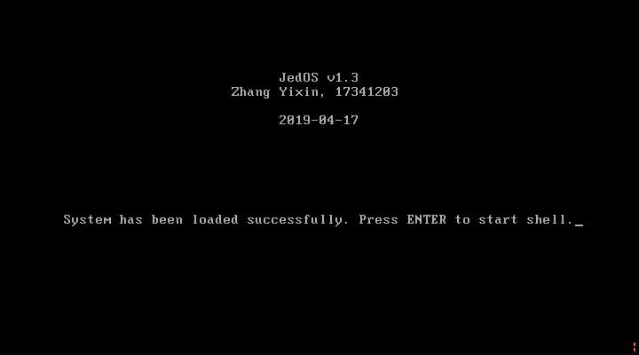
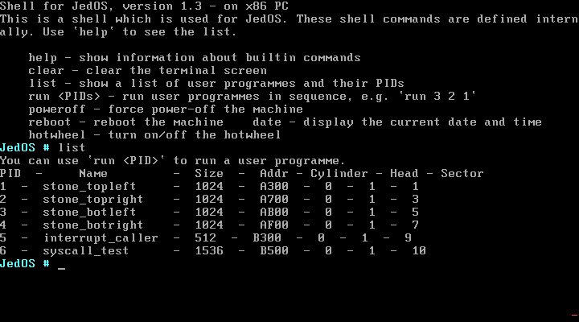
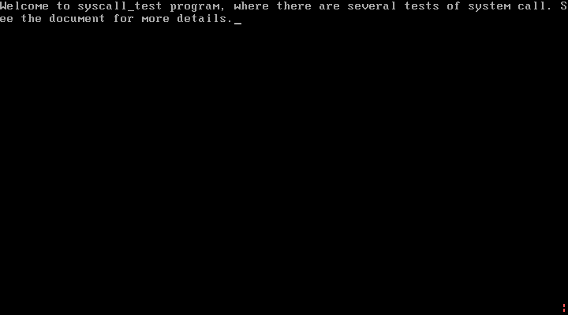
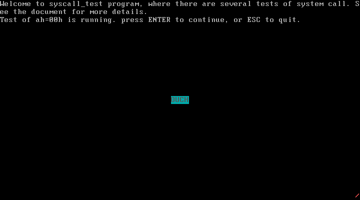
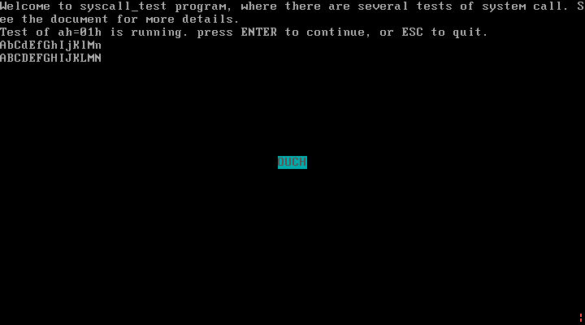
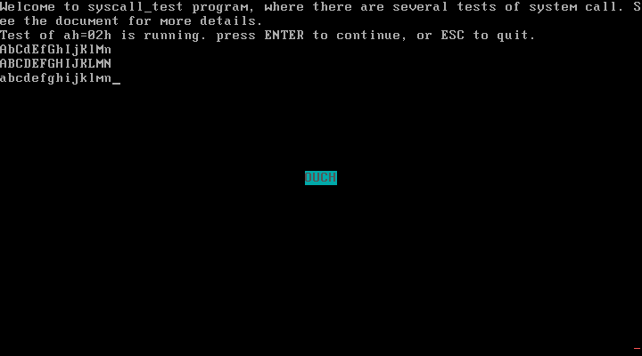
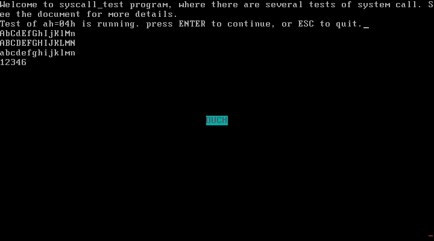
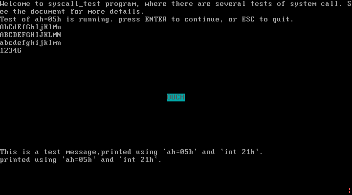
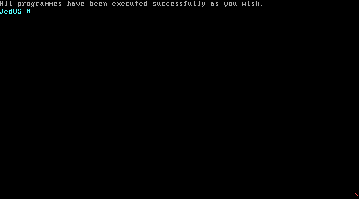
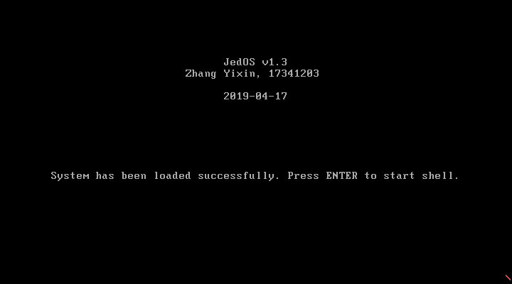

# 实验项目5：实现系统调用 

## 实验题目

实现系统调用 


## 实验目的

1. 理解系统调用的实现方法。
2. 实现原型操作系统中一些基本的系统调用。
3. 设计并实现一测试系统调用的用户程序，利用系统调用实现用户界面和内部功能。


## 实验要求

在实验四的基础上，进化你的原型操作系统，增加下列操作系统功能：

1. 参考下面的系统调用功能表，增加一些其他功能

   系统调用表（局部设计）

   | 功能号 | 入口参数                                      | 出口参数 | 功能描述                                                  |
   | ------ | --------------------------------------------- | -------- | --------------------------------------------------------- |
   | 0      | Ah=0                                          | 无       | 在屏幕中心显示 “OUCH”                                     |
   | 1      | Ah=1;   dx=串首偏移；   es=串段址；           | 无       | 将es:dx位置的一个字符串中的小字母变为大字                 |
   | 2      | Ah=2;   dx=串首偏移；   es=串段址；           | 无       | 将es:dx位置的一个字符串中的大字母变为小字                 |
   | 3      | Ah=3;   dx=串首偏移；   es=串段址；           | Ax=数值  | 将es:dx位置的一个数字字符串转变对应的数值                 |
   | 4      | Ah=4;   Bx=数值   dx=串首偏移；   es=串段址； | 无       | 将bx的数值转变对应的es:dx位置的一个数字字符串             |
   | 5      | Ah=4;   Cx=ch:行号cl:列号   dx=串首偏移；     | 无       | 将es:dx位置的一个字符串显示在屏幕指定位置(ch:行号cl:列号) |

2. 扩展MYOS内核，实现上表中的所有(包括你增加的)系统调用，并开发一个用户程序，展示这些系统调用的使用效果。


## 实验方案

### 特色与新功能

**实验中用到的工具列表**

- 物理机操作系统：Windows 10 (10.0.17763)
- 虚拟机软件：VMware Workstation 15 Pro
- 代码编辑器：Visual Studio Code 1.33.1
- Linux 环境：WSL Ubuntu, 4.4.0-17763-Microsoft
- 汇编编译器：NASM 2.11.08 (On Linux)
- C 语言编译器：GCC 5.4.0
- 链接器：GNU ld 2.26.1


**本次更新 & 额外功能说明**

1. 完成“实验要求”中的内容；
2. 重构引导程序`bootloader.asm`，使用宏语句代替了大段指令，使程序更加精简、易读；
3. 在`macro.asm`中新增了`LOAD_TO_MEM`这一宏，功能是从软盘中读取数据放到内存中的指定位置。用该宏代替了内核中的相关代码；
4. 新增`reboot`这一 shell 命令，功能是将 MBR 的一个扇区的内容装入内存 0x7C00，从而重启操作系统；


### 软盘扇区安排说明

我是按照这张表格来组织安排软盘中的内容的。注意扇区号从 1 开始。

| 磁头号 | 扇区号 | 扇区数（大小）  | 内容                           |
| ------ | ------ | --------------- | ------------------------------ |
| 0      | 1      | 1（512 B）      | 引导程序                       |
| 0      | 2      | 1（512 B）      | 存放用户程序信息的表           |
| 0      | 3~18   | 16（8 KB）      | 操作系统内核                   |
| 1      | 1~2    | 2（1 KB）       | 用户程序1                      |
| 1      | 3~4    | 2（1 KB）       | 用户程序2                      |
| 1      | 5~6    | 2（1 KB）       | 用户程序3                      |
| 1      | 7~8    | 2（1 KB）       | 用户程序4                      |
| 1      | 9      | 1（512 B）      | 调用 int 33h~36h 的用户程序    |
| **1**  | **10** | **3（1536 B）** | **展示系统调用效果的用户程序** |

上表的最后一行是本次实验新增的用户程序，该程序名为`syscall_test`，占用 3 个扇区，其功能是逐个测试系统调用。在用户程序信息表中（`userproginfo.asm`）我将其程序编号 PID 定为 6，因此可以在 shell 中输入`run 6`命令来执行该用户程序。


### 内核概述

内核的文件名与实验项目3相比有所调整。内核的源代码在以下几个文件中，功能全部由本人独立完成：

| 文件名          | 名称                 | 格式    | 内容简介                                                     |
| --------------- | -------------------- | ------- | ------------------------------------------------------------ |
| osstarter.asm   | 内核起始             | ASM     | 显示操作系统信息，提示用户进入 shell                         |
| liba.asm        | 内核的汇编部分       | ASM     | 包含了若干使用汇编语言编写的函数，可供汇编或C程序调用        |
| kernel.c        | n内核的 C 部分       | C       | 包含了若干使用 C 语言编写的函数，可供汇编或C程序调用。还包含了一个 shell |
| stringio.h      | 字符串与输入输出函数 | C       | 被`libc.c`包含，内有涉及字符串、键盘输入、屏幕输出等功能的实现代码 |
| **systema.asm** | **系统调用**         | **ASM** | **包含若干系统调用函数**                                     |
| **systemc.c**   | **系统调用**         | **C**   | **包含若干系统调用函数用到的辅助函数**                       |


JedOS v1.3 的 shell 支持的命令见下表，其中加粗的命令为最近额外增加的：

| 命令         | 功能                                                         |
| ------------ | ------------------------------------------------------------ |
| help         | 显示shell基本信息和支持的命令及其功能                        |
| clear        | 清屏                                                         |
| list         | 列出可以运行的用户程序                                       |
| run          | 按顺序批量地执行用户程序，可以执行一个或多个程序，如`run 1`执行用户程序1；`run 1 2 3`依次执行用户程序1、用户程序2、用户程序3。 |
| poweroff     | 强制关机                                                     |
| **reboot**   | **重启**                                                     |
| **date**     | **显示当前日期和时间**                                       |
| **hotwheel** | **显示或关闭风火轮**                                         |


### 功能号为 ah=00h 的系统调用

根据“实验要求”（见本文档开头部分），本系统调用的功能是**在屏幕中间显示“OUCH”**。

利用 BIOS 的 int 10h 实现在屏幕第 12 行、第 38 列打印彩色的“OUCH”字符串。在`systema.asm`中封装`sys_showOuch`函数：

```assembly
sys_showOuch:
    pusha             ; 保护现场
    push ds
    push es
    mov	ax, cs        ; 置其他段寄存器值与CS相同
    mov	ds, ax        ; 数据段
    mov	bp, ouch_str  ; BP=当前串的偏移地址
    mov	ax, ds        ; ES:BP = 串地址
    mov	es, ax        ; 置ES=DS
    mov	cx, 4         ; CX = 串长
    mov	ax, 1301h     ; AH = 13h（功能号）、AL = 01h（光标置于串尾）
    mov	bx, 0038h     ; 页号为0(BH = 0) 黑底白字(BL = 07h)
    mov dh, 12        ; 行号
    mov	dl, 38        ; 列号
    int	10h           ; BIOS的10h功能：显示一行字符
    pop es
    pop ds
    popa              ; 恢复现场
    ret
    ouch_str db 'OUCH'
```


### 功能号为 ah=01h 的系统调用

根据“实验要求”，本系统调用的功能是**将 es:dx 位置的一个字符串中的小写字母变为大写字母**。

用 C 语言实现此功能比较方便。在`systemc.c`中实现`toupper`函数：

```c
/* 将字符串中的小写字母转换为大写 */
void toupper(char* str) {
    int i=0;
    while(str[i]) {
        if (str[i] >= 'a' && str[i] <= 'z')  
        str[i] = str[i]-'a'+'A';
        i++;
    }
}
```


在`systema.asm`中封装：

```assembly
[extern toupper]
sys_toUpper:
    push es           ; 传递参数
    push dx           ; 传递参数
    call dword toupper
    pop dx            ; 丢弃参数
    pop es            ; 丢弃参数
    ret
```


### 功能号为 ah=02h 的系统调用

根据“实验要求”，本系统调用的功能是**将 es:dx 位置的一个字符串中的大写字母变为小写字母**。

与上一条基本类似，C 代码：

```c
/* 将字符串中的大写字母转换为小写 */
void tolower(char* str) {
    int i=0;
    while(str[i]) {
        if (str[i] >= 'A' && str[i] <= 'Z')  
        str[i] = str[i]-'A'+'a';
        i++;
    }
}
```


在`systema.asm`中封装：

```assembly
[extern tolower]
sys_toLower:
    push es           ; 传递参数
    push dx           ; 传递参数
    call dword tolower
    pop dx            ; 丢弃参数
    pop es            ; 丢弃参数
    ret
```


### 功能号为 ah=03h 的系统调用

根据“实验要求”，本系统调用的功能是**将 es:dx 位置的一个数字字符串转变对应的数值**。

使用 C 语言实现此功能。在`systemc.c`中实现`atoi`函数：

```c
/* 将十进制数字字符串转换为整数 */
int atoi(char *str) {
    int res = 0; // Initialize result 

    // Iterate through all characters of input string and 
    // update result 
    for (int i = 0; str[i] != '\0'; ++i) {
        res = res*10 + str[i] - '0'; 
    }
    // return result. 
    return res; 
}
```


在`systema.asm`中封装：

```assembly
[extern atoi]
sys_atoi:
    push es           ; 传递参数
    push dx           ; 传递参数
    call dword atoi
    pop dx            ; 丢弃参数
    pop es            ; 丢弃参数
    ret
```


### 功能号为 ah=04h 的系统调用

根据“实验要求”，本系统调用的功能是**将 bx 的数值转变对应的 es:dx 位置的一个数字字符串”**。

根据“实验要求”，本系统调用的功能是**将 es:dx 位置的一个数字字符串转变对应的数值**。

使用 C 语言实现此功能。在`systemc.c`中实现`itoa_buf`函数，该函数接受三个参数：num 为待转换的数字，base 为进制，str 为存放字符串的缓冲区地址。

```c
/* 翻转字符串 */
void my_reverse(char str[], int len)
{
	int start, end;
	char temp;
	for (start = 0, end = len - 1; start < end; start++, end--) {
		temp = *(str + start);
		*(str + start) = *(str + end);
		*(str + end) = temp;
	}
}

/* 将数字转换为字符串并放在str中 */
char* itoa_buf(int num, int base, char* str)
{
	int i = 0;
	bool isNegative = false;

	/* A zero is same "0" string in all base */
	if (num == 0) {
		str[i] = '0';
		str[i + 1] = '\0';
		return str;
	}

	/* negative numbers are only handled if base is 10
	   otherwise considered unsigned number */
	if (num < 0 && base == 10) {
		isNegative = true;
		num = -num;
	}

	while (num != 0) {
		int rem = num % base;
		str[i++] = (rem > 9) ? (rem - 10) + 'A' : rem + '0';
		num = num / base;
	}

	/* Append negative sign for negative numbers */
	if (isNegative) {
		str[i++] = '-';
	}

	str[i] = '\0';

	my_reverse(str, i);

	return str;
}
```


在`systema.asm`中封装：

```assembly
[extern itoa_buf]
sys_itoa:
    push es           ; 传递参数buf
    push dx           ; 传递参数buf
    mov ax, 0
    push ax           ; 传递参数base
    mov ax, 10        ; 10进制
    push ax           ; 传递参数base
    mov ax, 0
    push ax           ; 传递参数val
    push bx           ; 传递参数val
    call dword itoa_buf
    pop bx            ; 丢弃参数
    pop ax            ; 丢弃参数
    pop ax            ; 丢弃参数
    pop ax            ; 丢弃参数
    pop dx            ; 丢弃参数
    pop es            ; 丢弃参数
    ret
```


### 功能号为 ah=05h 的系统调用

根据“实验要求”，本系统调用的功能是**将 es:dx 位置的一个字符串显示在屏幕指定位置（ch:行号cl:列号）**。

BIOS 中已经提供了在指定位置打印字符串的功能了，我们要做的就是将其封装起来并隐藏掉一些不重要的参数。在`systema.asm`中实现`sys_printInPos`函数：

```assembly
[extern strlen]
sys_printInPos:
    pusha
    mov bp, dx        ; es:bp=串地址
    push es           ; 传递参数
    push bp           ; 传递参数
    call dword strlen ; 返回值ax=串长
    pop bp            ; 丢弃参数
    pop es            ; 丢弃参数
    mov bl, 07h       ; 颜色
    mov dh, ch        ; 行号
    mov dl, cl        ; 列号
    mov cx, ax        ; 串长
    mov bh, 0         ; 页码
    mov al, 0         ; 光标不动
    mov ah, 13h       ; BIOS功能号
    int 10h
    popa
    ret
```

注意到上面的代码中使用了一个外部函数`strlen`来获取字符串的长度。`strlen`函数在操作系统早期版本中已经使用过了，其源代码见`stringio.h`文件，编译后同样在内核中，因此在`sys_printInPos`中可以直接用 extern 引用`strlen`。回顾一下`strlen`的实现：

```c
/* 字符串长度 */
uint16_t strlen(const char *str) {
    int count = 0;
    while (str[count++] != '\0');
    return count - 1;  // 循环中使用后递增，因此这里需要减1
}
```


### 编写系统调用入口向量程序

需要编写一段代码来根据功能号去执行不同的系统调用。在`liba.asm`中增加一个函数：

```assembly
[extern sys_showOuch]
[extern sys_toUpper]
[extern sys_toLower]
[extern sys_atoi]
[extern sys_itoa]
[extern sys_printInPos]
syscaller:
    push ds
    push si                     ; 用si作为内部临时寄存器
    mov si, cs
    mov ds, si                  ; ds = cs
    mov si, ax
    shr si, 8                   ; si = 功能号
    add si, si                  ; si = 2 * 功能号
    call [sys_table+si]         ; 系统调用函数
    pop si
    pop ds
    iret                        ; int 21h中断返回
    sys_table:                  ; 存放功能号与系统调用函数映射的表
        dw sys_showOuch, sys_toUpper, sys_toLower
        dw sys_atoi, sys_itoa, sys_printInPos
```

以上函数通过 ah 的值在`sys_table`表中找到对应位置的项去执行。

当然，还要提前把`syscaller`放入 21h 号中断向量。在`osstarter.asm`中添加一行宏指令（宏实现在`macro.asm`中）完成此操作：

```assembly
WRITE_INT_VECTOR 21h, syscaller
```


### 编写测试用的用户程序

编写用户程序 syscall_test，逐个测试上面实现的 6 个系统调用。该用户程序的期望效果如下所述：

* 首先显示一行提示信息，表示已经进入 syscall_test 程序，并提示用户按下回车以开始测试系统调用。在以下步骤中，每测试完一个功能后，用户都需要按下回车继续测试下一个功能；

* 测试 ah=00h 功能，期望在屏幕中间显示出“OUCH”。

  ```assembly
  mov ah, 00h                        ; 系统调用功能号ah=00h，显示OUCH
  int 21h
  mov ah, 0
  int 16h
  cmp al, 27                         ; 按下ESC
  je QuitUsrProg                     ; 直接退出
  ```

* 测试 ah=01h 功能。定义一个名为`upper_lower`的 C 风格字符串（以'\0'结尾的字符串）变量，包含着多个大写字母和小写字母：

  ```assembly
  upper_lower db 'AbCdEfGhIjKlMn', 0 ; 字符串以'\0'结尾
  ```

  将该字符串的地址放入 es:dx，然后打印此字符串。之后使用功能号为 ah=01h 的系统调用将其中的大写字母转换为小写字母，转换完成后再次打印此字符串。

  ```assembly
  mov ax, cs
  mov es, ax                         ; es=cs
  mov dx, upper_lower                ; es:dx=串地址
  PRINT_IN_POS upper_lower, 14, 3, 0
  mov ah, 01h                        ; 系统调用功能号ah=01h，大写转小写
  int 21h
  PRINT_IN_POS upper_lower, 14, 4, 0
  mov ah, 0
  int 16h
  cmp al, 27                         ; 按下ESC
  je QuitUsrProg                     ; 直接退出
  ```

* 测试 ah=02h 功能。用系统调用把`upper_lower`中的小写字母全部转换为大写字母。

  ```assembly
  mov ax, cs
  mov es, ax                         ; es=cs
  mov dx, upper_lower                ; es:dx=串地址
  mov ah, 02h                        ; 系统调用功能号ah=02h，小写转大写
  int 21h
  PRINT_IN_POS upper_lower, 14, 5, 0
  mov ah, 0
  int 16h
  cmp al, 27                         ; 按下ESC
  je QuitUsrProg                     ; 直接退出
  ```

* 一并测试 ah=03h 和 ah=04h 功能。定义一个 C 风格字符串变量`number_buf`，内容是一个十进制数字（在 2 个字节的表示范围内）：

  ```assembly
  number_buf db '12345', 0           ; 字符串以'\0'结尾
  ```

  将其地址放入 es:dx，然后使用功能号为 ah=03h 的系统调用将该数字字符串转换为十进制数字，并放入 ax 寄存器中。接着，将 ax 寄存器的内容加 1 然后存入 bx 寄存器（bx 是 ah=04h 调用的入口参数）。使用功能号为 ah=04h 的系统调用将 bx 中的数字转换为十进制字符串，存入 es:dx。然后打印 es:dx 处的字符串。

  我们的操作是先将字符串 '12345' 转换成数字，将其加 1 后转换回字符串。按照预期，最后字符串中的内容应该是 '12346'，我们将在本文档后面的“实验过程”中验证此结果。

  ```assembly
  mov ax, cs
  mov es, ax                         ; es=cs
  mov dx, number_buf
  mov ah, 04h                        ; 系统调用功能号ah=04h，itoa
  int 21h                            ; es:dx=转换后的数字字符串
  mov ch, 6
  mov cl, 0
  mov ah, 05h
  int 21h
  
  mov ah, 0
  int 16h
  cmp al, 27                         ; 按下ESC
  je QuitUsrProg                     ; 直接退出
  ```

* 测试 ah=05h 功能。分别在第 19 行、第 20 行开头打印两行字符串。

  ```assembly
  mov ax, cs
  mov es, ax                         ; es=cs
  mov dx, test_message1              ; es:dx=串地址
  mov ch, 19                         ; 行号
  mov cl, 0                          ; 列号
  mov ah, 05h                        ; 系统调用功能号ah=05h
  int 21h                            ; 显示第一条字符串
  mov dx, test_message2
  mov ch, 20
  mov cl, 0
  int 21h                            ; 显示第二条字符串
  mov ah, 0
  int 16h
  cmp al, 27                         ; 按下ESC
  je QuitUsrProg                     ; 直接退出
  
  ...
  
  test_message1 db 'This is a test message,'
  test_message2 db 'printed using `ah=05h` and `int 21h`.'
  ```

  

### 自动化部署（Shell 脚本）

使用 Shell Script 在 Linux 下进行编译、链接、整合。

```bash
#!/bin/bash
rm -rf temp
mkdir temp
rm *.img

nasm bootloader.asm -o ./temp/bootloader.bin
nasm usrproginfo.asm -o ./temp/usrproginfo.bin

cd usrprog
nasm stone_topleft.asm -o ../temp/stone_topleft.bin
nasm stone_topright.asm -o ../temp/stone_topright.bin
nasm stone_bottomleft.asm -o ../temp/stone_bottomleft.bin
nasm stone_bottomright.asm -o ../temp/stone_bottomright.bin
nasm interrupt_caller.asm -o ../temp/interrupt_caller.bin
nasm syscall_test.asm -o ../temp/syscall_test.bin
cd ..

cd lib
nasm -f elf32 systema.asm -o ../temp/systema.o
gcc -c -m16 -march=i386 -masm=intel -nostdlib -ffreestanding -mpreferred-stack-boundary=2 -lgcc -shared systemc.c -o ../temp/systemc.o
cd ..

nasm -f elf32 hotwheel.asm -o ./temp/hotwheel.o

nasm -f elf32 osstarter.asm -o ./temp/osstarter.o
nasm -f elf32 liba.asm -o ./temp/liba.o
gcc -c -m16 -march=i386 -masm=intel -nostdlib -ffreestanding -mpreferred-stack-boundary=2 -lgcc -shared kernel.c -o ./temp/kernel.o
ld -m elf_i386 -N -Ttext 0x8000 --oformat binary ./temp/osstarter.o ./temp/liba.o ./temp/kernel.o ./temp/systema.o ./temp/systemc.o ./temp/hotwheel.o -o ./temp/kernel.bin
rm ./temp/*.o

dd if=./temp/bootloader.bin of=JedOS_v1.3.img bs=512 count=1 2> /dev/null
dd if=./temp/usrproginfo.bin of=JedOS_v1.3.img bs=512 seek=1 count=1 2> /dev/null
dd if=./temp/kernel.bin of=JedOS_v1.3.img bs=512 seek=2 count=16 2> /dev/null
dd if=./temp/stone_topleft.bin of=JedOS_v1.3.img bs=512 seek=18 count=2 2> /dev/null
dd if=./temp/stone_topright.bin of=JedOS_v1.3.img bs=512 seek=20 count=2 2> /dev/null
dd if=./temp/stone_bottomleft.bin of=JedOS_v1.3.img bs=512 seek=22 count=2 2> /dev/null
dd if=./temp/stone_bottomright.bin of=JedOS_v1.3.img bs=512 seek=24 count=2 2> /dev/null
dd if=./temp/interrupt_caller.bin of=JedOS_v1.3.img bs=512 seek=26 count=1 2> /dev/null
dd if=./temp/syscall_test.bin of=JedOS_v1.3.img bs=512 seek=27 count=3 2> /dev/null


echo "[+] Done."
```


执行这个脚本，生成 JedOS_v1.3.img 镜像文件。


## 实验过程

启动虚拟机，引导程序自动加载操作系统，并进入内核，显示欢迎画面：




屏幕右下角有一红色风火轮在转动，它是在实验项目4中实现的功能。

按下回车键，进入 shell 界面，可以看到列出的可以执行的 shell 命令。这里的大部分命令在之前的实验项目中已经测试过了，因此这里不再重复测试。首先输入`list`查看可以运行的用户程序列表。




PID 为 6 的 syscall_test 是测试系统调用的用户程序。输入`run 6`进入此程序，开始逐个测试系统调用。

进入 syscall_test 后，显示如下界面：




按下回车，测试 ah=00h 功能。屏幕中间显示出了一个“OUCH”，符合预期。




按下回车，测试 ah=01h 功能。屏幕上方多出了两行字符串——第一行是变量`upper_lower`的原始值，可以看到其中既有大写字母又有小写字母（详见本文档的“实验方案”栏目）；第二行是通过系统调用转换成全大写字母的结果。




按下回车，测试 ah=02h 功能。多出的一行字符串是将`upper_lower`转换成全小写字母的结果。




按下回车，测试 ah=03h 功能。似乎什么都没有发生，实际上，已经系统已经把数字字符串 '12345' 转换成了数字 12345 并存入 bx 寄存器了，这一转换暂时没有在屏幕上体现出来，不过我们马上可以间接地看到这一结果。

按下回车，测试 ah=04h 功能。屏幕上显示了 '12346'，这是把数字 12345 加 1 后转换为字符串并打印出来的结果，是符合预期的。（详见本文档的“实验方案”栏目）




按下回车，测试 ah=05h 功能。屏幕下方第 19 行和第 20 行位置显示了两行字符串，如图。




按下回车或 ESC，退出 syscall_test，返回 shell 界面。当然，在以上过程的任意阶段按下 ESC，都可以立即退出用户程序并返回到 shell。




系统调用全部测试完毕了，下面来测试一下新增加的`reboot`命令。在 shell 界面输入`reboot`，执行后回到刚刚进入操作系统的画面，就像是重启了机器一样。




最后，在 shell 中输入`poweroff`，关机，完成本次实验。


## 实验总结

### 警示与技巧

1. **栈平衡**。堆栈入栈时从高地址向低地址增长，且一般使用 bp 寄存器来跟踪参数。调用函数时，需要先用`push`指令将参数依次压栈，右边的参数先入栈。参数都按顺序入栈以后，才能使用`call`指令进行子函数调用。子函数返回后，主调函数（caller）要负责将栈中的参数丢弃掉——这称为***栈平衡***，其意义是保证函数调用前后 sp 是一致的。常用的栈平衡是“外平衡”，即由函数外部保持栈平衡，因此在函数调用之后要使用`pop`命令将参数丢弃掉。

2. **使用宏**。使用宏可以减小程序的冗余性，因为不需要在多个地方编写相同的代码了。将常用的代码“封装”成宏，并将所有的宏都放在同一个文件`macro.asm`中，在需要用到这些宏的地方`%include "macro.asm"`即可。再者，将过程写在宏中，方便调试和修改，因为只需修改`macro.asm`中的宏定义，即可起到修改所有用到该宏的代码，而不需要逐个地修改，既简便，又减少了出错的可能性。

   我一直喜欢使用宏，在本次实验项目中新增了一个

3. **软盘的结构**。一个 3.5 英寸的 1.44 MB 的软盘由 80 个磁道、18 个扇区构成，而且有 2 个柱面。首先使用的是 0 柱面、0 磁道的扇区，扇区编号从 1 到 18。再往后，是 0 柱面 、1 磁道，扇区号又是从 1 到 18……依此类推。


### 心得与体会

起初我是认为系统调用没有意义的，我当时觉得如果将所有函数实现在内核中，调用起来更加方便，不需要经过“封装”成系统调用这一中转的过程，反而将问题复杂化了。不过后来编写用户程序时我就明白了系统调用的意义。

如果没有系统调用，在内核中封装的函数只能由内核本身调用。比如我在内核中定义了一个函数`foo()`，那么能够调用`foo()`的范围仅限于与内核一同编译的代码中。独立编译的用户程序完全无法找到`foo()`函数的存在。作为一个操作系统，肯定要支持用户程序等这类“内核以外的代码”的执行。显然，我们不可能把用户程序与内核一起编译，那样就毫无扩展性可言了。

使用系统调用解决了以上问题。我们可以在内核中实现若干功能的系统调用，将它们封装起来，并由一个中断来管理所有系统调用（比如 21h 号中断）。这样一来，用户程序中就可以使用功能号加`int 21h`指令这样的方式来调用内核中的函数了。用户程序和内核完全不需要一起编译——系统调用的动作完全是在运行时“动态地”发生的。

以上是我对系统调用意义的理解。


### 已知问题

**使用`reboot`重启后导致`hotwheel`命令失效的问题**。问题表现是重启后，`hotwheel`命令不能正常地打开或隐藏风火轮。原因已找到，但尚未修复：在 JedOS v1.3 的实现中使用的是`int 19h`来达到重启的目的——根据该 BIOS 中断的行为得知，虽然可以它使机器重新载入和执行引导程序，但是它并不会将内存的其他部分、寄存器等地方的数据重置为就像机器刚上电的那种状态。因此，重启后 08h 号中断向量处理程序已经是“风火轮”程序（`Timer`）了，此后尝试使用`hotwheel`命令将无法打开或隐藏屏幕右下角的风火轮。


## 参考资料

1. [汇编-----栈的平衡 && 现场保护](https://www.jianshu.com/p/c5a2e346f0ed)