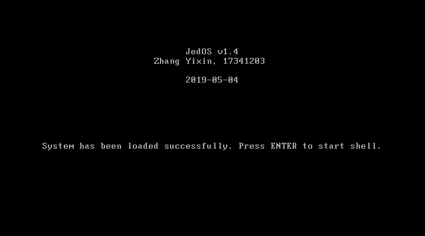
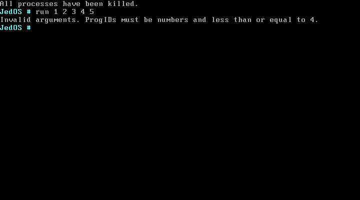
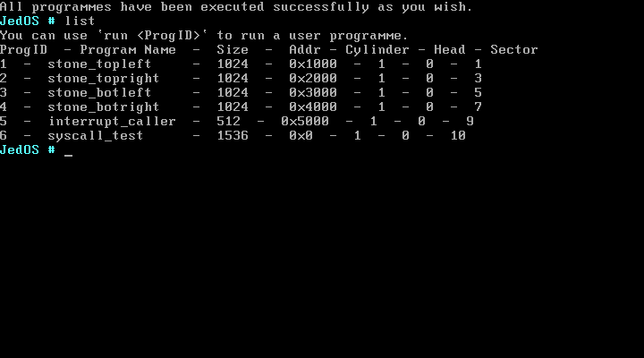
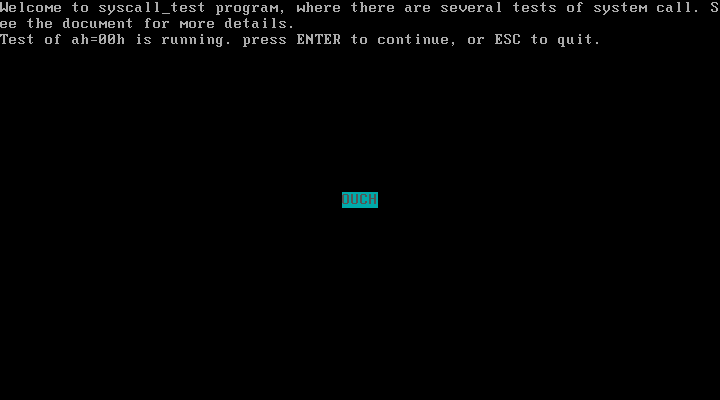
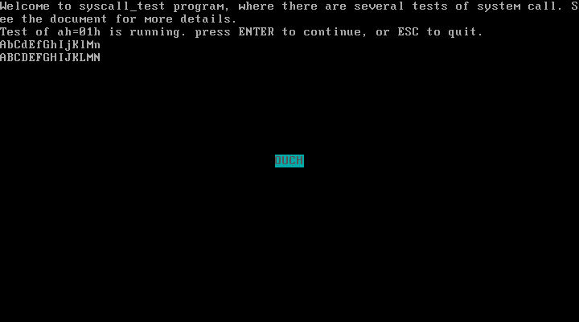
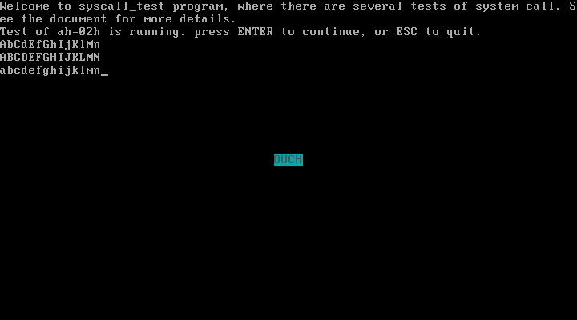
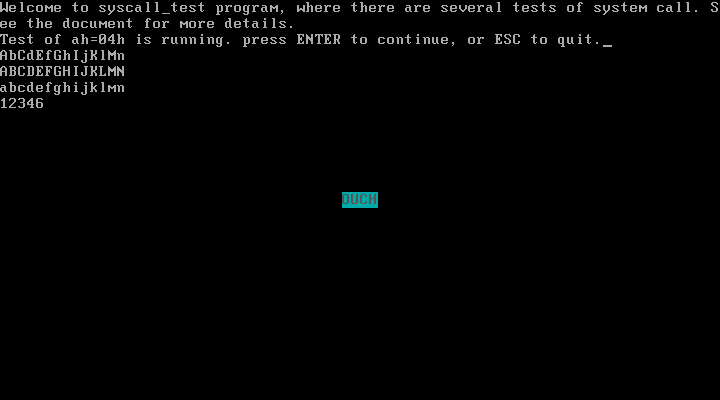
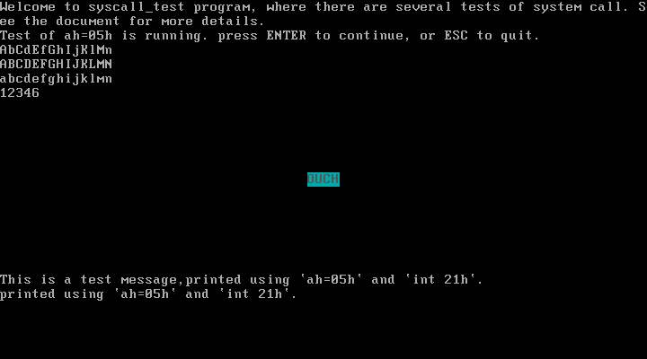
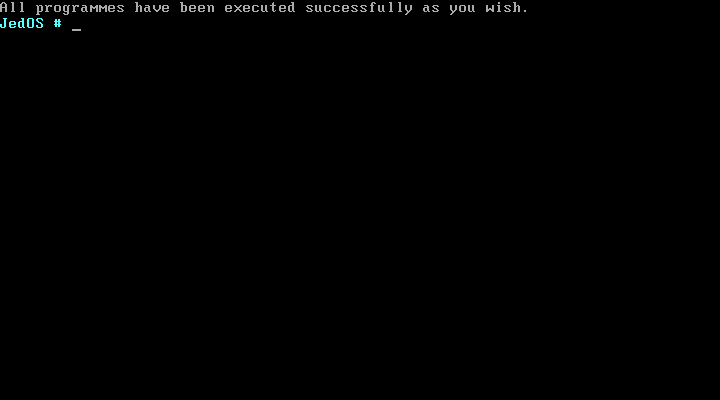

# 实验项目6：二状态进程模型 

## 实验题目

二状态进程模型


## 实验目的

1. 学习进程模型知识，掌握进程模型的实现方法；
2. 利用时钟中断，设计时钟中断处理进行进程交替执行；
3. 扩展MyOS，实现多进程模型的原型操作系统。


## 实验要求

保留原型原有特征的基础上，设计满足下列要求的新原型操作系统：

1. 在C程序中定义进程表，进程数量为4个；
2. 内核一次性加载4个用户程序运行时，采用时间片轮转调度进程运行，用户程序的输出各占1/4屏幕区域，信息输出有动感，以便观察程序是否在执行；
3. 在原型中保证原有的系统调用服务可用。再编写1个用户程序，展示系统调用服务还能工作。


## 实验方案

### 特色与新功能

**实验中用到的工具列表**

- 物理机操作系统：Windows 10 (10.0.17763)
- 虚拟机软件：VMware Workstation 15 Pro
- 代码编辑器：Visual Studio Code 1.33.1
- Linux 环境：WSL Ubuntu, 4.4.0-17763-Microsoft
- 汇编编译器：NASM 2.11.08 (On Linux)
- C 语言编译器：GCC 5.4.0
- 链接器：GNU ld 2.26.1


**本次更新 & 额外功能说明**

1. 完成“实验要求”中的内容。其中“多进程切换”的相关代码为**纯汇编**实现；
2. 将软盘中的内核由 16 个扇区扩充为 34 个扇区；
3. **将批处理的命令改为`bat`（batch 的缩写）；现在`run`命令的功能是并发执行多个进程**；
4. 优化内核中的部分代码，使其更好地支持段间转移。


### 软盘扇区安排说明

我是按照这张表格来组织安排软盘中的内容的。注意扇区号从 1 开始。

| 柱面号 | 磁头号  | 扇区号       | 扇区数（大小）  | 内容                        |
| ------ | ------- | ------------ | --------------- | --------------------------- |
| 0      | 0       | 1            | 1（512 B）      | 引导程序                    |
| 0      | 0       | 2            | 1（512 B）      | 存放用户程序信息的表        |
| **0**  | **0~1** | **0:3~1:18** | **34（17 KB）** | **操作系统内核**            |
| 1      | 0       | 1~2          | 2（1 KB）       | 用户程序1                   |
| 1      | 0       | 3~4          | 2（1 KB）       | 用户程序2                   |
| 1      | 0       | 5~6          | 2（1 KB）       | 用户程序3                   |
| 1      | 0       | 7~8          | 2（1 KB）       | 用户程序4                   |
| 1      | 0       | 9            | 1（512 B）      | 调用 int 33h~36h 的用户程序 |
| 1      | 0       | 10           | 3（1536 B）     | 展示系统调用效果的用户程序  |

操作系统内核功能正在逐渐增加，体积也在不断变大，所以必须给内核分配更多的空间。简便起见，本次实验中**给内核分配 34 个扇区**（从 0 号磁头的 3 号扇区到 1 号磁头的 18 号扇区）。用户程序则放到 1 号柱面、0 号磁头上的扇区中。


### 内核概述

内核的源代码在以下几个文件中，功能全部由本人独立完成：

| 文件名               | 名称                 | 格式    | 内容简介                                                     |
| -------------------- | -------------------- | ------- | ------------------------------------------------------------ |
| osstarter.asm        | 内核起始             | ASM     | 显示操作系统信息，提示用户进入 shell                         |
| liba.asm             | 内核的汇编部分       | ASM     | 包含了若干使用汇编语言编写的函数，可供汇编或C程序调用        |
| kernel.c             | n内核的 C 部分       | C       | 包含了若干使用 C 语言编写的函数，可供汇编或C程序调用。还包含了一个 shell |
| stringio.h           | 字符串与输入输出函数 | C       | 被`libc.c`包含，内有涉及字符串、键盘输入、屏幕输出等功能的实现代码 |
| systema.asm          | 系统调用             | ASM     | 包含若干系统调用函数                                         |
| systemc.c            | 系统调用             | C       | 包含若干系统调用函数用到的辅助函数                           |
| **multiprocess.asm** | **多进程模型**       | **ASM** | **定义 PCB、实现进程调度、寄存器保存与恢复等**               |


JedOS v1.4 的 shell 支持的命令见下表，其中加粗的命令为最近新增或修改的：

| 命令     | 功能                                                         |
| -------- | ------------------------------------------------------------ |
| help     | 显示shell基本信息和支持的命令及其功能                        |
| clear    | 清屏                                                         |
| list     | 列出可以运行的用户程序                                       |
| **bat**  | **按顺序批量地执行用户程序（批处理），可以执行一个或多个程序。如`bat 1`执行用户程序1；`run 1 2 3`依次执行用户程序1、用户程序2、用户程序3。** |
| **run**  | **创建多个进程并开始执行。如`run 1 2 3`可并发执行用户程序1、用户程序2、用户程序3** |
| poweroff | 强制关机                                                     |
| reboot   | 重启                                                         |
| date     | 显示当前日期和时间                                           |

注意：此版本中的`bat`命令与先前版本的`run`功能相同，bat 为 batch 的缩写，意为批处理。而此版本中的`run`的功能是先前版本中不存在的，它以并发的方式运行多个用户程序。


---


### 准备工作：使每个用户程序独占一个段

先前版本的用户程序与操作系统内核处于同一个段中，这不利于进程切换。本次实验中，规定内核加载在第一个 64K 中（段值为 0x0000）；用户程序从第二个 64K 内存开始分配，每个进程 64 K，即**四个普通用户程序的段值分别为 0x1000、0x2000、0x3000、0x4000**。在我的源码中，用户程序的地址以常量的形式写在`macro.asm`中：

```assembly
addr_oskernel equ 08000h    ; 操作系统内核被装入的位置

addr_usrprog1 equ 10000h    ; 四个普通用户程序的物理地址
addr_usrprog2 equ 20000h    ; 四个普通用户程序的物理地址
addr_usrprog3 equ 30000h    ; 四个普通用户程序的物理地址
addr_usrprog4 equ 40000h    ; 四个普通用户程序的物理地址
addr_intcaller equ 50000h
addr_syscalltest equ 60000h
```


理论上，用户程序无需做任何修改，不过为了后续实验的便捷性，以及为了防止多进程之间产生冲突，我对四个普通用户程序做了略微修改：

1. 删除了用户程序中检测 ESC 按键的代码，因为多进程的退出应由操作系统来管理；
2. 删除了用户程序显示提示字符串，因为四个用户程序都在同一个位置显示字符串会造成冲突；
3. 修改了每个用户程序动态显示字符的起始位置，这是为了使得多个程序同时运行是错落有致，避免死板。

除此之外，用户程序的主体与之前相同。


### 设立时钟中断标志 timer_flag

只有在运行多进程的时候才需要时钟中断进行 save - schedule - restart 操作，其他时候，时钟中断内什么都不需要做，直接返回。实现方法是设置一个标志变量`timer_flag`，初始化为 0，表示无需操作；当用户执行了`run`命令后、将要运行多进程前，将`timer_flag`标志置为 1，表示开始进行多进程轮转。

在`multiprocess.asm`中定义标志：

```assembly
timer_flag dw 0
```


在`kernel.c`中引用该变量：

```c
extern uint16_t timer_flag;
```


时钟中断处理程序的雏形：

```assembly
Timer:                        ; 08h号时钟中断处理程序
    cli                       ; 关中断，不允许时钟中断嵌套
    cmp word[cs:timer_flag], 0
    je QuitTimer
    
    ...  ; save过程
    ...  ; schedule过程
    ...  ; restart过程
    
QuitTimer:
    push ax
    mov al, 20h
    out 20h, al
    out 0A0h, al
    pop ax
    sti                       ; 开中断
    iret
```


### 定义进程控制块（PCB）和进程表

在汇编中定义 8 个进程控制块，编号从 0 到 7。每个 PCB 的结构都相同，因此考虑使用宏：

```assembly
%macro ProcessControlBlock 1  ; 参数：段值
    dw 0                      ; ax，偏移量=+0
    dw 0                      ; cx，偏移量=+2
    dw 0                      ; dx，偏移量=+4
    dw 0                      ; bx，偏移量=+6
    dw 0FE00h                 ; sp，偏移量=+8
    dw 0                      ; bp，偏移量=+10
    dw 0                      ; si，偏移量=+12
    dw 0                      ; di，偏移量=+14
    dw %1                     ; ds，偏移量=+16
    dw %1                     ; es，偏移量=+18
    dw %1                     ; fs，偏移量=+20
    dw 0B800h                 ; gs，偏移量=+22
    dw %1                     ; ss，偏移量=+24
    dw 0                      ; ip，偏移量=+26
    dw %1                     ; cs，偏移量=+28
    dw 512                    ; flags，偏移量=+30
    db 0                      ; id，进程ID，偏移量=+32
    db 0                      ; state，{0:新建态; 1:就绪态; 2:运行态}，偏移量=+33
%endmacro

pcb_table:                    ; 定义PCB表
pcb_0: ProcessControlBlock 0
pcb_1: ProcessControlBlock 1000h
pcb_2: ProcessControlBlock 2000h
pcb_3: ProcessControlBlock 3000h
pcb_4: ProcessControlBlock 4000h
pcb_5: ProcessControlBlock 0
pcb_6: ProcessControlBlock 0
pcb_7: ProcessControlBlock 0
```

一个 PCB 占 34 个字节，注释中的“偏移量”的意思是相对于当前 PCB 首地址的偏移字节数。


### 现场保护：save 过程

基本思路是，将此过程写成一个汇编函数`pcbSave`，在进入时钟中断后立即将所有寄存器的值压栈，然后调用该函数。在`pcbSave`函数中，从栈上取得寄存器的值，并将它们保存在当前进程 （由`current_process_id`确定）的 PCB 中。当然，汇编语言中 mov 指令的两个操作数不能都是存储器操作数，因此需要用 ax 寄存器中转一下。

这里简要说明一下如何找到当前 PCB 的地址。我们之前定义了 8 个 PCB，每个 PCB 占 34 个字节，它们是连续存放的，首地址在标签`pcb_table`处。变量`current_process_id`保存着当前进程的序号，因此，当前 PCB 的首地址可由`pcb_table + current_process_id * 34`算出。

`pcbSave`函数的代码如下：

```assembly
pcbSave:                      ; 函数：现场保护
    pusha
    mov bp, sp
    add bp, 16+2              ; 参数首地址
    mov di, pcb_table

    mov ax, 34
    mul word[cs:current_process_id]
    add di, ax                ; di指向当前PCB的首地址

    mov ax, [bp]
    mov [cs:di], ax
    mov ax, [bp+2]
    mov [cs:di+2], ax
    mov ax, [bp+4]
    mov [cs:di+4], ax
    mov ax, [bp+6]
    mov [cs:di+6], ax
    mov ax, [bp+8]
    mov [cs:di+8], ax
    mov ax, [bp+10]
    mov [cs:di+10], ax
    mov ax, [bp+12]
    mov [cs:di+12], ax
    mov ax, [bp+14]
    mov [cs:di+14], ax
    mov ax, [bp+16]
    mov [cs:di+16], ax
    mov ax, [bp+18]
    mov [cs:di+18], ax
    mov ax, [bp+20]
    mov [cs:di+20], ax
    mov ax, [bp+22]
    mov [cs:di+22], ax
    mov ax, [bp+24]
    mov [cs:di+24], ax
    mov ax, [bp+26]
    mov [cs:di+26], ax
    mov ax, [bp+28]
    mov [cs:di+28], ax
    mov ax, [bp+30]
    mov [cs:di+30], ax

    popa
    ret
```


### 进程调度：schedule 过程

在二进程模型中，进程调度的目的是把`current_process_id`的值修改为下一个处于**就绪态**进程的序号。

可以将其写成一个汇编函数`pcbSchedule`，它的实现思路如下：首先将当前进程的状态由运行态改为就绪态，然后递增`current_process_id`使其指向下一个进程，并检查下一进程的状态是否是就绪态，若是就绪态，则调度完毕；若不是就绪态，则循环递增`current_process_id`直到找到一个就绪进程。当然，`current_process_id`的值不应该超过 7，因此需要在其超过 7 时把它重置为 1。基于以上思路编写代码：

```assembly
pcbSchedule:                  ; 函数：进程调度
    pusha
    mov si, pcb_table
    mov ax, 34
    mul word[cs:current_process_id]
    add si, ax                ; si指向当前PCB的首地址
    mov byte[cs:si+33], 1     ; 将当前进程设置为就绪态

    try_next_pcb:             ; 循环地寻找下一个处于就绪态的进程
        inc word[cs:current_process_id]
        add si, 34            ; si指向下一PCB的首地址
        cmp word[cs:current_process_id], 7
        jna pcb_not_exceed    ; 若id递增到8，则将其恢复为1
        mov word[cs:current_process_id], 1
        mov si, pcb_table+34  ; si指向1号进程的PCB的首地址

    pcb_not_exceed:
        cmp byte[cs:si+33], 1 ; 判断下一进程是否处于就绪态
        jne try_next_pcb      ; 不是就绪态，则尝试下一个进程
        mov byte[cs:si+33], 2 ; 是就绪态，则设置为运行态。调度完毕
    popa
    ret
```

注意，这并不是最终版本的`pcbSchedule`，后面我们在实现杀死进程、返回内核时还要修改这个函数。详见后文。


### 现场恢复：restart 过程

由于需要改写寄存器，本过程不适合写成函数，因此该过程直接写在时钟中断里面。具体要做的事就是从调度后的新 PCB 中取出各个寄存器的值并将它们恢复到相应寄存器中去。我使用 si 寄存器来间址，在恢复了所有其他寄存器后，最后恢复 si 寄存器。

在这个过程中，需要格外注意的是 sp 寄存器。注意到在为`pcbSave`函数传参的过程中，传递的 sp 的值并不是发生时钟中断前的那个用户进程的 sp 的值。在进入时钟中断后，首先栈中会增加 psw、cs、ip 共 3 个字，然后又压入了 ss、gs、fs、es、ds、di、si、bp 共 8 个字。这样，最后恢复的 sp 的值实际上比正确的 sp 的值偏小了 11 个字，也就是 22 个字节，必须将其加上。

在恢复完所有寄存器的值后，就可以准备“返回”进程了。只需依次将**新**进程的 psw、cs、ip压栈，然后中断返回即可。

这部分完整代码如下：

```assembly
pcbRestart:                   ; 不是函数
    mov si, pcb_table
    mov ax, 34
    mul word[cs:current_process_id]
    add si, ax                ; si指向调度后的PCB的首地址

    mov ax, [cs:si+0]
    mov cx, [cs:si+2]
    mov dx, [cs:si+4]
    mov bx, [cs:si+6]
    mov sp, [cs:si+8]
    mov bp, [cs:si+10]
    mov di, [cs:si+14]
    mov ds, [cs:si+16]
    mov es, [cs:si+18]
    mov fs, [cs:si+20]
    mov gs, [cs:si+22]
    mov ss, [cs:si+24]
    add sp, 11*2              ; 恢复正确的sp

    push word[cs:si+30]       ; 新进程flags
    push word[cs:si+28]       ; 新进程cs
    push word[cs:si+26]       ; 新进程ip

    push word[cs:si+12]
    pop si                    ; 恢复si

QuitTimer:
    push ax
    mov al, 20h
    out 20h, al
    out 0A0h, al
    pop ax
    sti                       ; 开中断
    iret
```


至此，时钟中断处理程序编写完毕！


### 从 shell 进入多进程

我们的目的是根据输入的`run`命令的参数之后，开始并发运行响应编号的用户程序。举个例子，当输入`run 1 2 3 4`时，并发运行四个用户程序；当输入`run 1 3`时，并发执行两个用户程序。

首先，需要把将要运行的用户程序写入内存中的规定地址去，并把对应的 PCB 中的`state`字段设置为就绪态，还要初始化 PCB 中的段寄存器。上面这几个功能写成一个函数，并放在`multiprocess.asm`文件中。*该函数是由 32 位的 C 代码调用的，因此需要用`retf`来返回。*

```assembly
loadProcessMem:                    ; 函数：将某个用户程序加载入内存并初始化其PCB
    pusha
    mov bp, sp
    add bp, 16+4                   ; 参数地址
    LOAD_TO_MEM [bp+12], [bp], [bp+4], [bp+8], [bp+16], [bp+20]

    mov si, pcb_table
    mov ax, 34
    mul word[bp+24]                ; progid_to_run
    add si, ax                     ; si指向新进程的PCB

    mov ax, [bp+24]                ; ax=progid_to_run
    mov byte[cs:si+32], al         ; id
    mov ax, [bp+16]                ; ax=用户程序的段值
    mov word[cs:si+16], ax         ; ds
    mov word[cs:si+18], ax         ; es
    mov word[cs:si+20], ax         ; fs
    mov word[cs:si+24], ax         ; ss
    mov word[cs:si+28], ax         ; cs
    mov byte[cs:si+33], 1          ; state设其状态为就绪态
    popa
    retf
```


在内核`kernel.c`中编写执行`run`命令后的处理函数`multiProcessing`，这个函数的结构和批处理`batch`比较类似。首先要检查用户提供的参数是否都是有效的，如果无效，那么不会运行多进程，而是打印一条错误提示。只有`run`后的数字为 1、2、3、4中的一个或多个才被认为是有效的；其他情况均视为无效参数。参数检查通过后，循环地为每一个用户进程调用`loadProcessMem`函数（见上方），将用户程序从软盘装入内存，然后将对应的 PCB 中的状态设置为就绪态。完毕后，设置`timer_flag`为1，从而允许时钟中断开始在多个进程中轮转。

`multiProcessing`的完整代码：

```c
void multiProcessing(char* cmdstr) {
    char progids[BUFLEN+1];
    getAfterFirstWord(cmdstr, progids);  // 获取run后的参数列表
    uint8_t isvalid = 1;  // 参数有效标志位
    if(progids[0] == '\0') { isvalid = 0; }
    for(int i = 0; progids[i]; i++) {  // 判断参数是有效的
        if(!isnum(progids[i]) && progids[i]!=' ') {  // 既不是数字又不是空格，无效参数
            isvalid = 0;
            break;
        }
        if(isnum(progids[i]) && progids[i]-'0'>4) {  // 只能运行前4个用户程序
            isvalid = 0;
            break;
        }
    }
    if(isvalid) {  // 参数有效，则按顺序执行指定的用户程序
        int i = 0;
        for(int i = 0; progids[i] != '\0'; i++) {
            if(isnum(progids[i])) {  // 是数字（不是空格）
                int progid_to_run = progids[i] - '0';  // 要运行的用户程序ProgID
                loadProcessMem(getUsrProgCylinder(progid_to_run), getUsrProgHead(progid_to_run), getUsrProgSector(progid_to_run), getUsrProgSize(progid_to_run)/512, getUsrProgAddrSeg(progid_to_run), getUsrProgAddrOff(progid_to_run), progid_to_run);
            }
        }
        timer_flag = 1;  // 允许时钟中断处理多进程
        Delay();
        timer_flag = 0;  // 禁止时钟中断处理多进程
        clearScreen();
        const char* hint = "All processes have been killed.\r\n";
        print(hint);
    }
    else {  // 参数无效，报错，不执行任何用户程序
        const char* error_msg = "Invalid arguments. ProgIDs must be numbers and less than or equal to 4.";
        print(error_msg);
        NEWLINE;
    }
}
```


### 杀死所有进程

这提供了一种从多进程运行状态返回到内核的方法，当按下 ESC 时退出用户程序并回到内核。这种效果与批处理十分相似，不过处理方法完全不同。多进程中返回内核的操作是在时钟中断处理程序中完成的（而不是由用户程序自身实现）。

注意到首次由内核进入多进程运行模式时，**内核的寄存器状态信息被保存在了 0 号PCB 中**，因此在返回内核前只需使调度器选择 0 号 PCB 即可。另外，返回内核前还要将其余 PCB 全部重置，以便下次重新进入多进程。修改后的`pcbSchedule`如下：

```assembly
pcbSchedule:                       ; 函数：进程调度
    pusha
    mov si, pcb_table
    mov ax, 34
    mul word[cs:current_process_id]
    add si, ax                     ; si指向当前PCB的首地址
    mov byte[cs:si+33], 1          ; 将当前进程设置为就绪态

    mov ah, 01h                    ; 功能号：查询键盘缓冲区但不等待
    int 16h
    jz try_next_pcb                ; 无键盘按下，继续
    mov ah, 0                      ; 功能号：查询键盘输入
    int 16h
    cmp al, 27                     ; 是否按下ESC
    jne try_next_pcb               ; 若按下ESC，回到内核；否则调度用户程序

    mov word[cs:current_process_id], 0
    mov word[cs:timer_flag], 0     ; 禁止时钟中断处理多进程
    
    call resetAllPcbExceptZero
    
    jmp QuitSchedule               ; 跳转回内核
    try_next_pcb:                  ; 循环地寻找下一个处于就绪态的进程
        inc word[cs:current_process_id]
        add si, 34                 ; si指向下一PCB的首地址
        cmp word[cs:current_process_id], 7
        jna pcb_not_exceed         ; 若id递增到8，则将其恢复为1
        mov word[cs:current_process_id], 1
        mov si, pcb_table+34       ; si指向1号进程的PCB的首地址
    pcb_not_exceed:
        cmp byte[cs:si+33], 1      ; 判断下一进程是否处于就绪态
        jne try_next_pcb           ; 不是就绪态，则尝试下一个进程
        mov byte[cs:si+33], 2      ; 是就绪态，则设置为运行态。调度完毕
    QuitSchedule:
    popa
    ret
```


为了保证下次还能正常地使用`run`命令进入多进程，需要及时地将 PCB 表中的 PCB 重置位初始状态。这是`resetAllPcbExceptZero`函数的功能，该函数把 1 到 7 号 PCB 中的所有寄存器映像全部重置为默认值。该函数在`pcbSchedule`中被调用。

```assembly
resetAllPcbExceptZero:
    push cx
    push si
    mov cx, 7                      ; 共8个PCB
    mov si, pcb_table+34

    loop1:
        mov word[cs:si+0], 0       ; ax
        mov word[cs:si+2], 0       ; cx
        mov word[cs:si+4], 0       ; dx
        mov word[cs:si+6], 0       ; bx
        mov word[cs:si+8], 0FE00h  ; sp
        mov word[cs:si+10], 0      ; bp
        mov word[cs:si+12], 0      ; si
        mov word[cs:si+14], 0      ; di
        mov word[cs:si+16], 0      ; ds
        mov word[cs:si+18], 0      ; es
        mov word[cs:si+20], 0      ; fs
        mov word[cs:si+22], 0B800h ; gs
        mov word[cs:si+24], 0      ; ss
        mov word[cs:si+26], 0      ; ip
        mov word[cs:si+28], 0      ; cs
        mov word[cs:si+30], 512    ; flags
        mov byte[cs:si+32], 0      ; id
        mov byte[cs:si+33], 0      ; state=新建态
        add si, 34                 ; si指向下一个PCB
        loop loop1

    pop si
    pop cx
    ret
```


### 保证原有系统调用可用

原有系统调用一直可用，无需修改，请参见“实验过程”中的演示。

不过为了扩充功能，我新增了一个获取`timer_flag`的系统调用，后文马上就要说到这一点。


### 自动化部署（Shell 脚本）

使用 Shell Script 在 Linux 下进行编译、链接、整合。

```bash
#!/bin/bash
rm -rf temp
mkdir temp
rm *.img

nasm bootloader.asm -o ./temp/bootloader.bin
nasm usrproginfo.asm -o ./temp/usrproginfo.bin

cd usrprog
nasm stone_topleft.asm -o ../temp/stone_topleft.bin
nasm stone_topright.asm -o ../temp/stone_topright.bin
nasm stone_bottomleft.asm -o ../temp/stone_bottomleft.bin
nasm stone_bottomright.asm -o ../temp/stone_bottomright.bin
nasm interrupt_caller.asm -o ../temp/interrupt_caller.bin
nasm syscall_test.asm -o ../temp/syscall_test.bin
cd ..

cd lib
nasm -f elf32 systema.asm -o ../temp/systema.o
gcc -c -m16 -march=i386 -masm=intel -nostdlib -ffreestanding -mpreferred-stack-boundary=2 -lgcc -shared systemc.c -o ../temp/systemc.o
cd ..

nasm -f elf32 osstarter.asm -o ./temp/osstarter.o
nasm -f elf32 liba.asm -o ./temp/liba.o
nasm -f elf32 multiprocess.asm -o ./temp/multiprocess.o
gcc -c -m16 -march=i386 -masm=intel -nostdlib -ffreestanding -mpreferred-stack-boundary=2 -lgcc -shared kernel.c -o ./temp/kernel.o
ld -m elf_i386 -N -Ttext 0x8000 --oformat binary ./temp/osstarter.o ./temp/liba.o ./temp/kernel.o ./temp/systema.o ./temp/systemc.o ./temp/multiprocess.o -o ./temp/kernel.bin
# rm ./temp/*.o

dd if=./temp/bootloader.bin of=JedOS_v1.4.img bs=512 count=1 2> /dev/null
dd if=./temp/usrproginfo.bin of=JedOS_v1.4.img bs=512 seek=1 count=1 2> /dev/null
dd if=./temp/kernel.bin of=JedOS_v1.4.img bs=512 seek=2 count=34 2> /dev/null
dd if=./temp/stone_topleft.bin of=JedOS_v1.4.img bs=512 seek=36 count=2 2> /dev/null
dd if=./temp/stone_topright.bin of=JedOS_v1.4.img bs=512 seek=38 count=2 2> /dev/null
dd if=./temp/stone_bottomleft.bin of=JedOS_v1.4.img bs=512 seek=40 count=2 2> /dev/null
dd if=./temp/stone_bottomright.bin of=JedOS_v1.4.img bs=512 seek=42 count=2 2> /dev/null
dd if=./temp/interrupt_caller.bin of=JedOS_v1.4.img bs=512 seek=44 count=1 2> /dev/null
dd if=./temp/syscall_test.bin of=JedOS_v1.4.img bs=512 seek=45 count=3 2> /dev/null


echo "[+] Done."
```

执行这个脚本，生成 JedOS_v1.4.img 镜像文件。


---


以下是实验要求以外的新增功能。

### 增加一个系统调用：获取 timer_flag

`timer_flag`是内核中的一个变量，当它为 0 时，代表没有多进程在运行；当它为 1 时，代表正在进行多进程轮转。时钟中断根据该变量的值来做出的处理。

有些情况下，用户程序需要获取`timer_flag`变量的值，从而确定自己是在以批处理方式还是多进程方式运行。然而，用户程序代码与内核完全独立，它们之间不可能共享变量。解决方案是采用系统调用。在我的实现中，编写 06h 功能号的系统调用：

```assembly
sys_timer_flag:
    mov ax, [cs:timer_flag]
    ret
```


在用户程序中用到了这个功能。如果是以批处理方式运行用户程序时，则要在按下 ESC 时退出用户程序；如果是以多进程方式运行时，则不响应键盘（因为多进程的退出由内核控制，无需用户程序干预）。用户程序的改动如下：

```assembly
mov ah, 06h             ; 功能号：获取timer_flag
int 21h                 ;ax=timer_flag
cmp ax, 0
jne continue            ; 如果已设置timer_flag，则不进行键盘判断
mov ah, 01h             ; 功能号：查询键盘缓冲区但不等待
int 16h
jz continue             ; 无键盘按下，继续
mov ah, 0               ; 功能号：查询键盘输入
int 16h
cmp al, 27              ; 是否按下ESC
je QuitUsrProg          ; 若按下ESC，退出用户程序
```


## 实验过程

启动虚拟机，进入欢迎画面。




### 测试多进程：run 命令

按下回车，进入 shell。我们重点测试`run`命令。

输入`run 1 2 3 4`，创建四个进程，然后并发地运行它们。可以看到屏幕的四个角分别显示动态效果。


按下 ESC，回到内核，并显示了一条提示信息。


输入`run 1 4`，创建两个进程，然后并发地运行它们。可以看到屏幕左上角、右下角显示动画，而另外两个角落没有显示。


按下 ESC，回到内核。输入`run 3`，尝试仅创建一个进程。


之后，测试更多参数组合，均符合预期。

下面测试非法参数。输入`run 1 2 3 4 5`，显示了一条错误提示便退出了，并没有任何进程运行。




再试试一些重复的参数。输入`run 1 3 2 2 1 1`，可以看到只有 1、2、3 三个进程在运行，这也是符合预期的：


### 测试批处理：bat 命令

>  再次说明一下，本次实验（实验项目 6）中的`bat`命令，就是之前实验（实验项目 3~5）中的`run`命令，它的功能是以**批处理方式**运行多个用户程序。


输入`bat 1 3 2 4`，按下回车。开始运行用户程序 1；按下 ESC，进入用户程序 3；按下 ESC，进入用户程序 2；按下 ESC，进入用户程序 4。最后按下 ESC，回到 shell 界面，并显示了一条提示信息。

**注意体会多进程（run）和批处理（bat）中 ESC 按键的行为的不同之处。**

由于效果与之前的实验相同，这里就不在放中间过程截图了。下面的是批处理结束后的画面：


### 测试原有系统调用可用

有一个用户程序`syscall_test`专门测试各个系统调用。输入`list`查看该用户程序的详细信息，可以看到它的序号是 6。




该用户程序只能以批处理方式运行。我们输入`bat 6`进入 syscall_test 后，显示如下界面：


按下回车，测试 ah=00h 功能。屏幕中间显示出了一个“OUCH”，符合预期。




按下回车，测试 ah=01h 功能。屏幕上方多出了两行字符串——上面的是变量`upper_lower`的原始值，可以看到其中既有大写字母又有小写字母（详见本文档的“实验方案”栏目）；下面的是通过系统调用转换成全大写字母的结果。




按下回车，测试 ah=02h 功能。多出的一行字符串是将`upper_lower`转换成全小写字母的结果。




按下回车，测试 ah=03h 功能。似乎什么都没有发生，实际上，已经系统已经把数字字符串 '12345' 转换成了数字 12345 并存入 bx 寄存器了，这一转换暂时没有在屏幕上体现出来，不过我们马上可以间接地看到这一结果。

按下回车，测试 ah=04h 功能。屏幕上显示了 '12346'，这是把数字 12345 加 1 后转换为字符串并打印出来的结果，是符合预期的。




按下回车，测试 ah=05h 功能。屏幕下方第 19 行和第 20 行位置显示了两行字符串，如图。




按下回车或 ESC，退出 syscall_test，返回 shell 界面。当然，在以上过程的任意阶段按下 ESC，都可以立即退出用户程序并返回到 shell。




### 关机，结束实验

在 shell 中输入`poweroff`，关机，完成本次实验。


## 实验总结

### 警示与技巧

* **逻辑地址、线性地址和物理地址。**在没有开启分页机制的情况下，线性地址就是物理地址，在本次实验中，仅用逻辑地址和物理地址。简单来讲，在 8086 中逻辑地址由 16 位的段值和 16 位的偏移量共同构成 20 位的物理地址。计算方法是，将段值左移 4 位（乘以十进制的 16）再加上偏移量即的到物理地址。

  一个物理地址可能由多个不同的逻辑地址表示，因此将物理地址拆分成逻辑地址的结果不是唯一的。在我的实现中，均认为段值的低 12 位全 0。这样规定后，将物理地址拆分成逻辑地址的方法就是`phys_addr >> 4 & 0F000h`。在`usrproginfo.asm`大量用到了这种拆分方法。

  这里记录一下我最初犯的错误——以为左移的是 4 个十六进制数（16 个二进制位）。

* **软盘的结构。**在上一个实验（实验项目 5）中在软盘里给内核分配了 16 个扇区共 32KB。而在本次实验中，操作系统内核的体积达到了约 8.5KB，原先的空间已经不够存放了。所以考虑将其增加到 34 个扇区。这样一来，用户程序存放的位置只能继续往后移动。如果把 18 个扇区看作一个单位，那么本次实验共用到了 3 个单位。第一个单位为柱面 0、磁头 0、扇区 1~18；第二个单位为柱面 0、磁头 1、扇区 1~18；第三个单位为柱面 1、磁头 0、扇区1~18。


### 心得与体会

实现多进程的思路是十分清晰的：save 过程负责将所有寄存器的值保存到存储器中的 PCB 内，schedule 过程负责选择下一个就绪进程，restart 过程负责把被调度的下一个进程 PCB 中的值恢复到对应的寄存器中，最后返回到被调度进程即可。

思路清晰不代表做起来容易。由于寄存器的保护、恢复必须非常严谨，不能有任何错误，所以事先设计出一个详细、严格的步骤是非常重要的。本次实验我做了很长时间，总共产生了 4 个大版本，只有最后一个（也就是现在的这个）才是成功的，前面的 3 个大版本都是与现在版本不同的实现方法，但是由于没有提前设计就直接上手编写代码了，导致写出的 bug 难以调试，而且过于零散，反而影响到原来实现过了的功能，导致整个操作系统越来越乱，自己都搞不清楚。只能忍痛回滚，从头再来（感谢 Git！）。在失败的版本上浪费的总时间超过 20 小时。总结一下，不要着急上手写代码，先弄清楚原理、设计好步骤以后再编程。

**寄存器 sp 需要特殊对待。**进入中断、函数调用等操作都会对栈进行操作，因此作为栈指针的 sp 寄存器的变化比其他寄存器要多得多。即使是时钟中断的第一行代码处，sp 的值已经比进入时钟中断之前减小了 6——因为进入中断会将 psw、cs、ip 压栈。调用`pcbSave`之前，已经把所有寄存器都`push`到栈里面了，包括 sp 寄存器。在我的代码中，在`push sp`之前已经压栈了 8 个其他寄存器。综上，实际保存到 PCB 中的 sp 的值比发生时钟中断之前要小 2\*11=22 个字节。这就是为什么`PcbRestart`过程在恢复 sp 后要将其加上 22 的原因。

从时钟中断“返回”到另一进程十分巧妙。我之所以在“返回”一词上打引号，是因为发生调度后，回到的已经不是当初进入时钟中断之前的那个位置了。我们知道，进入中断前会自动地把 psw、cs、ip 压入堆栈，因此，如果我们想在结束中断后转移到另一个位置，只需要修改栈上的这三个值就行了。在`PcbRestart`尾部的三条连着的`push`指令的功能就是改写返回地址。


### 已知问题

* **四个用户程序的显示区域有交集。**这是当时设计用户程序时的遗留问题，不同的用户程序的边界有重叠。比如“左上角（用户程序 1）的下边界”和左“下角（用户程序 3）”都是第 12 行。执行`run 1 3`即可观察到这一问题，如图所示：

  

  这一小错误仅影响视觉效果，并不影响多进程模型，也不会导致任何实质问题，因此暂不考虑修复。

