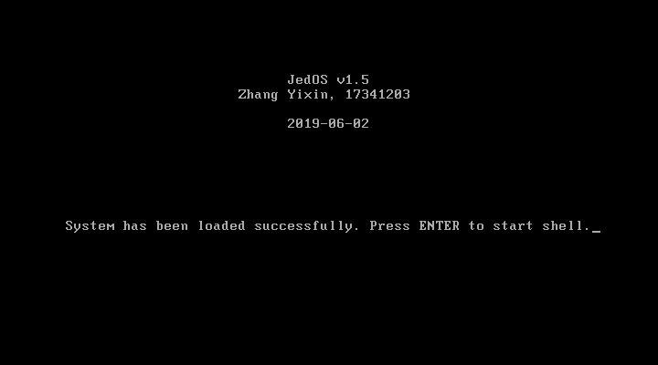
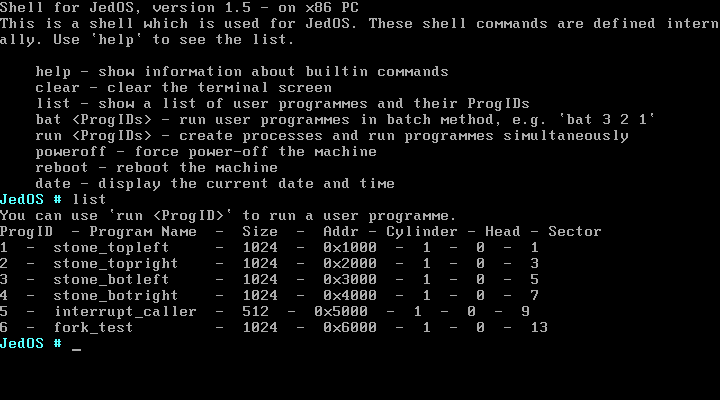
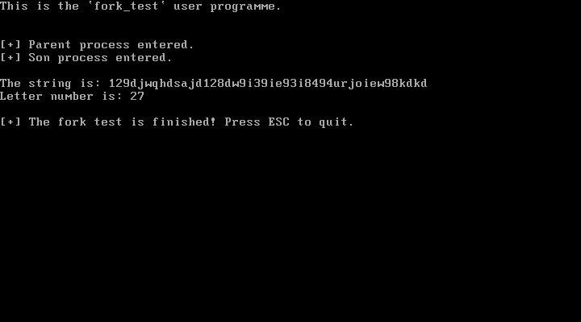
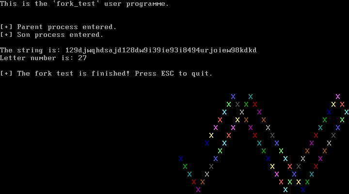

# 实验项目7：进程控制与通信 

## 实验题目

进程控制与通信（五状态进程模型）


## 实验目的

1. 学习多进程控制方法，掌握进程控制的实现方法。
2. 完成调度程序，实现有阻塞状态的进程模型
3. 扩展MyOS，实现多进程模型的父子进程同步。


## 实验要求

在实验五或更后的原型基础上，进化你的原型操作系统，原型保留原有特征的基础上，设计满足下列要求的新原型操作系统：

1. 实现控制的基本原语do_fork()、 do_wait()、do_exit()、blocked()和wakeup()。
2. 内核实现三系统调用fork()、 wait()和exit() ，并在c库中封装相关的系统调用.
3. 编写一个c语言程序，实现多进程合作的应用程序。
4. 多进程合作的应用程序可以在下面的基础上完成：由父进程生成一个字符串，交给子进程统计其中字母的个数，然后在父进程中输出这一统计结果。


## 实验方案

### 实验环境与工具

- 物理机操作系统：Windows 10 (10.0.18362)
- 虚拟机软件：VMware Workstation 15 Pro
- 代码编辑器：Visual Studio Code 1.34.0
- Linux 环境：WSL Ubuntu 18.04, 4.4.0-18362-Microsoft
- 汇编编译器：NASM 2.13.02 (On Linux)
- C 语言编译器：GCC 7.4.0
- 链接器：GNU ld 2.30


### 软盘扇区安排说明

我是按照这张表格来组织安排软盘中的内容的。注意扇区号从 1 开始，表中的“0:3”表示 0 号磁头的 3 号柱面。

| 柱面号 | 磁头号 | 扇区号   | 扇区数（大小） | 内容                        |
| ------ | ------ | -------- | -------------- | --------------------------- |
| 0      | 0      | 1        | 1（512 B）     | 引导程序                    |
| 0      | 0      | 2        | 1（512 B）     | 存放用户程序信息的表        |
| 0      | 0~1    | 0:3~1:18 | 34（17 KB）    | 操作系统内核                |
| 1      | 0      | 1~2      | 2（1 KB）      | 用户程序1                   |
| 1      | 0      | 3~4      | 2（1 KB）      | 用户程序2                   |
| 1      | 0      | 5~6      | 2（1 KB）      | 用户程序3                   |
| 1      | 0      | 7~8      | 2（1 KB）      | 用户程序4                   |
| 1      | 0      | 9        | 1（512 B）     | 调用 int 33h~36h 的用户程序 |
| 1      | 0      | 10       | 3（1536 B）    | 展示系统调用效果的用户程序  |


### 内核概述

内核的源代码在以下几个文件中：

| 文件名               | 名称                 | 格式    | 内容简介                                                     |
| -------------------- | -------------------- | ------- | ------------------------------------------------------------ |
| osstarter.asm        | 内核起始             | ASM     | 显示操作系统信息，提示用户进入 shell                         |
| liba.asm             | 内核的汇编部分       | ASM     | 包含了若干使用汇编语言编写的函数，可供汇编或C程序调用        |
| kernel.c             | n内核的 C 部分       | C       | 包含了若干使用 C 语言编写的函数，可供汇编或C程序调用。还包含了一个 shell |
| stringio.h           | 字符串与输入输出函数 | C       | 被`libc.c`包含，内有涉及字符串、键盘输入、屏幕输出等功能的实现代码 |
| systema.asm          | 系统调用             | ASM     | 包含若干系统调用函数                                         |
| systemc.c            | 系统调用             | C       | 包含若干系统调用函数用到的辅助函数                           |
| **multiprocess.asm** | **多进程模型**       | **ASM** | **辅助 process.h，直接操作寄存器和栈；fork、wait、exit原语** |
| **process.h**        | **多进程模型**       | **C**   | **定义 PCB、进程调度；do_fork、do_wait、do_exit 实现**       |


JedOS v1.5 的 shell 支持的命令见下表：

| 命令     | 功能                                                         |
| -------- | ------------------------------------------------------------ |
| help     | 显示shell基本信息和支持的命令及其功能                        |
| clear    | 清屏                                                         |
| list     | 列出可以运行的用户程序                                       |
| **bat**  | **按顺序批量地执行用户程序（批处理），可以执行一个或多个程序。如`bat 1`执行用户程序1；`run 1 2 3`依次执行用户程序1、用户程序2、用户程序3。** |
| **run**  | **创建多个进程并开始执行。如`run 1 2 3`可并发执行用户程序1、用户程序2、用户程序3** |
| poweroff | 强制关机                                                     |
| reboot   | 重启                                                         |
| date     | 显示当前日期和时间                                           |


-----


### 重构实验 6

我的实验 6 的多进程功能是用纯汇编实现的，若在纯汇编的基础上完成本次实验将会非常困难和麻烦，因此我先重构了实验 6。

重构的主要内容是把和 PCB 相关的许多定义和函数放到了 C 代码中，即 process.h 头文件。比如 PCB 结构体的定义：

```c
typedef struct RegisterImage{
	uint16_t ax;     // 0
	uint16_t cx;     // 2
	uint16_t dx;     // 4
	uint16_t bx;     // 6
	uint16_t sp;     // 8
	uint16_t bp;     // 10
	uint16_t si;     // 12
	uint16_t di;     // 14
	uint16_t ds;     // 16
	uint16_t es;     // 18
	uint16_t fs;     // 20
	uint16_t gs;     // 22
	uint16_t ss;     // 24
	uint16_t ip;     // 26
	uint16_t cs;     // 28
	uint16_t flags;  // 30
} RegisterImage;

typedef struct PCB{
	RegisterImage regimg;
	uint8_t id;     // 32
    uint8_t state;  // 33
}PCB;
```


用枚举类型来表示进程状态：

```c
enum PCB_STATE {P_NEW, P_READY, P_RUNNING, P_BLOCKED, P_EXIT};
```


获取当前 PCB 的首地址、获取整个 PCB 的首地址的函数。注意这些函数既可以通过 C 调用，也可以通过汇编调用：

```c
/* 获取当前进程的PCB指针 */
PCB* getCurrentPcb() {
    return &pcb_table[current_process_id];
}

/* 获取PCB表的首地址 */
PCB* getPcbTable() {
    return &pcb_table[0];
}
```


最重要的进程调度函数：

```c
/* 进程调度 */
void pcbSchedule() {
	uint16_t privious_id = current_process_id;
	getCurrentPcb()->state = P_READY;
	do {
		current_process_id++;
		if(current_process_id >= PROCESS_NUM) current_process_id = 1;
	} while(getCurrentPcb()->state != P_READY);
	getCurrentPcb()->state = P_RUNNING;
}
```

以上调度函数的思想和实验 6 中的完全一致，只不过是换了一种语言实现而已。每次调度时，先将当前进程状态设置为就绪态`P_READY`，然后用 do-while 循环进行轮询，直到找到另一个就绪态进程，然后将新进程的 ID 赋值给`current_process_id`。


`Timer`、`pcbSave`等函数和`loadProcessMem`、`PcbRestart`等过程需要直接操作寄存器，因此仍然用汇编语言编写在`multiprocess.asm`中，与实验 6 几乎没有区别。

由于后面的 fork、wait、exit 等过程都需要执行“从 PCB 中恢复寄存器”这一操作，因此我将原来的`PcbRestart`过程封装为宏，方便后面使用：

```assembly
%macro  PCB_RESTART 0              ; 宏：从PCB中恢复寄存器的值
    call dword getCurrentPcb
    mov si, ax
    mov ax, [cs:si+0]
    mov cx, [cs:si+2]
    mov dx, [cs:si+4]
    mov bx, [cs:si+6]
    mov sp, [cs:si+8]
    mov bp, [cs:si+10]
    mov di, [cs:si+14]
    mov ds, [cs:si+16]
    mov es, [cs:si+18]
    mov fs, [cs:si+20]
    mov gs, [cs:si+22]
    mov ss, [cs:si+24]
    add sp, 11*2                   ; 恢复正确的sp
    push word[cs:si+30]            ; 新进程flags
    push word[cs:si+28]            ; 新进程cs
    push word[cs:si+26]            ; 新进程ip
    push word[cs:si+12]
    pop si                         ; 恢复si
%endmacro
```


### 进程创建 fork

进程的派生过程由 `do_fork()`函数完成，它要进行的操作如下：

1. 先在PCB表查找空闲的表项，若没有找到，则派生失败；
2. 若找到空闲的PCB表项，则将父进程的PCB表复制给子进程，并将父进程的堆栈内容复制给子进程的堆栈，然后为子进程分配一个 ID；
3. 父子进程中对`do_fork`函数的返回值分别设置。


我们将 fork 视作系统调用，为其分配中断号`int 22h`，在`osstarter.asm`中（即刚进入操作系统时）写入中断向量表。

中断处理函数为`sys_fork`，代码在`multiprocess.asm`源文件里。该函数首先将所有寄存器压栈，然后调用`pcbSave`函数，将当前正在运行的进程保存到 PCB 中，然后调用 C 函数`do_fork`完成进程派生的工作，最后从 PCB 中恢复寄存器的值，最后中断返回。

```assembly
sys_fork:
    push ss
    push gs
    push fs
    push es
    push ds
    push di
    push si
    push bp
    push sp
    push bx
    push dx
    push cx
    push ax
    mov ax, cs
    mov ds, ax                     ; ds=cs，因为函数中可能要用到ds
    mov es, ax                     ; es=ax，原因同上。注意此时尚未发生栈切换
    call pcbSave                   ; 将寄存器的值保存在PCB中
    add sp, 16*2                   ; 丢弃参数
    call dword do_fork
    PCB_RESTART                    ; 恢复寄存器

    iret                           ; 退出sys_fork
```

注意以上代码中的`PCB_RESTART`是一个宏。


`do_fork`函数定义在`process.h`中，该函数首先遍历 PCB 表，尝试找到一个空位。如果没有空位，那么将当前进程 PCB 中的 ax 寄存器改为 -1 作为函数返回值，表示 fork 失败；如果找到空位了，那么将这个空位的 ID 作为`sid`（子进程 ID），然后将当前进程（父进程）PCB 中的 ax 寄存器改为`sid`作为返回值，然后将父进程的栈完整地拷贝一份到子进程的堆栈段 ss 中。最后，要把子进程的 ax 寄存器设为 0 作为子进程中 fork 的返回值，还要把子进程 PCB 的`id`字段改为父进程的序号（这是为了方便子进程 exit 能够找到父进程并恢复父进程的运行）。

```c
void do_fork() {
	uint16_t sid = 1;  // 子进程ID
	for(sid = 1; sid < PROCESS_NUM; sid++) {
		if(pcb_table[sid].state == P_NEW) break;
	}
	if(sid >= PROCESS_NUM || sid <= 0) {
		getCurrentPcb()->regimg.ax = -1;  // fork失败，给父进程返回-1
	}
	else {
		getCurrentPcb()->regimg.ax = sid;  // fork成功，给父进程返回子进程ID
		initSubPcb(sid);  // 为子进程初始化PCB
		copyStack();      // 拷贝父进程的栈到子进程的栈
		pcb_table[sid].regimg.ax = 0;
		pcb_table[sid].id = current_process_id;  // 父进程的ID
	}
}
```


`do_fork`内调用了`initSubPcb`，该函数初始化子进程的 PCB，其实是把父进程的 PCB 复制一份给子进程（除了 ax 寄存器和 ss 寄存器）。为了统一管理，我默认每个进程的堆栈段为 ID × 0x1000，如 6 号进程的堆栈段为 0x6000。在`initSubPcb`中，为`stack_length`、`from_seg`、`to_seg`三个全局变量赋值（这三个全局变量定义在`multiprocess.asm`中），分别为栈的大小、父进程的堆栈段、子进程的堆栈段，设置这些值是为后续栈拷贝做铺垫。

```c
void initSubPcb(uint16_t sid) {
	pcb_table[sid].id = sid;
	pcb_table[sid].state = P_READY;  // 设置子进程为就绪态
	pcb_table[sid].regimg.ax = 0;    // 子进程的fork返回值=0
	pcb_table[sid].regimg.cx = getCurrentPcb()->regimg.cx;
	pcb_table[sid].regimg.dx = getCurrentPcb()->regimg.dx;
	pcb_table[sid].regimg.bx = getCurrentPcb()->regimg.bx;
	pcb_table[sid].regimg.sp = getCurrentPcb()->regimg.sp;
	pcb_table[sid].regimg.bp = getCurrentPcb()->regimg.bp;
	pcb_table[sid].regimg.si = getCurrentPcb()->regimg.si;
	pcb_table[sid].regimg.di = getCurrentPcb()->regimg.di;
	pcb_table[sid].regimg.ds = getCurrentPcb()->regimg.ds;
	pcb_table[sid].regimg.es = getCurrentPcb()->regimg.es;
	pcb_table[sid].regimg.fs = getCurrentPcb()->regimg.fs;
	pcb_table[sid].regimg.gs = getCurrentPcb()->regimg.gs;
	pcb_table[sid].regimg.ss = sid * 0x1000;  // 子进程的堆栈段
	pcb_table[sid].regimg.ip = getCurrentPcb()->regimg.ip;
	pcb_table[sid].regimg.cs = getCurrentPcb()->regimg.cs;
	pcb_table[sid].regimg.flags = getCurrentPcb()->regimg.flags;

	stack_length = 0xFE00 - pcb_table[sid].regimg.sp;
	from_seg = getCurrentPcb()->regimg.ss;
	to_seg = pcb_table[sid].regimg.ss;
}
```


栈拷贝函数`copyStack`以汇编语言编写，由`do_fork`调用。`copyStack`中只需使用`movsw`进行串操作即可，注意拷贝的方向是由高地址向低地址，因此用`cld`指令设置方向标志位。

```assembly
copyStack:
    pusha
    push ds
    push es

    mov ax, word[to_seg]           ; 子进程 ss
    mov es,ax
    mov di, 0
    mov ax, word[from_seg]         ; 父进程 ss
    mov ds, ax
    mov si, 0
    mov cx, word[stack_length]     ; 栈的大小
    cld
    rep movsw                      ; ds:si->es:di

    pop es
    pop ds
    popa
    retf
```


### 阻塞进程 wait

当进程调用 wait 时，内核将该进程阻塞，然后通过调度挑选另一个就绪进程接权执行。

wait 的整体结构与 fork 类似。我们将 wait 视作系统调用，为其分配中断号`int 23h`，在`osstarter.asm`中（即刚进入操作系统时）写入中断向量表。

中断处理函数为`sys_wait`，代码在`multiprocess.asm`源文件里。该函数首先将所有寄存器压栈，然后调用`pcbSave`函数，将当前正在运行的进程保存到 PCB 中，然后调用 C 函数`do_wait`完成进程阻塞以及调度的工作，最后从 PCB 中恢复寄存器的值，最后中断返回。

`do_wait`函数中只需把当前进程置为阻塞态，然后调用调度函数即可。由于我的调度函数`pcbSchedule`内部会首先将当前进程设置为就绪态，会与`do_wait`中希望设置为阻塞态相违背，因此我用一个临时变量`to_be_blocked`保存希望阻塞的进程，然后在调度后设置其为阻塞态即可：

```c
void do_wait() {
	PCB* to_be_blocked = getCurrentPcb();
	pcbSchedule();
	to_be_blocked->state = P_BLOCKED;
}
```


调度函数不需要修改，因为调度函数的 do-while 循环的停止条件是找到一个处于就绪态的进程，它显然不会选择一个处于阻塞态的进程。


### 进程退出 exit

子进程终止时，调用 exit，**向父进程报告这一事件，从而解除父进程的阻塞**。然后调用进程调度过程挑选另一个就绪进程接权。

exit 的整体结构与 fork 和 wait 都类似。我们将 exit 视作系统调用，为其分配中断号`int 24h`，在`osstarter.asm`中（即刚进入操作系统时）写入中断向量表。

中断处理函数为`sys_exit`，代码在`multiprocess.asm`源文件里。该函数首先将所有寄存器压栈，然后调用`pcbSave`函数，将当前正在运行的进程保存到 PCB 中，然后调用 C 函数`do_exit`完成进程退出以及调度的工作，最后从 PCB 中恢复寄存器的值，最后中断返回。

`do_exit`函数将子进程的状态设置为退出态`P_EXIT`，并通过子进程 PCB 中保存的父进程 ID 找到父进程的 PCB，并将父进程由阻塞态恢复为就绪态，然后调用进程调度函数，选择另一个就绪进程执行。

```c
void do_exit() {
	PCB* to_exit = getCurrentPcb();
	getCurrentPcb()->state = P_EXIT;
	pcb_table[getCurrentPcb()->id].state = P_READY;
	pcbSchedule();
	to_exit->state = P_EXIT;
}
```


---


### 用户程序 fork_test

这是一个独立的用户程序，在此程序中，由父进程生成一个字符串（包含小写字母和数字），然后通过 fork 产生一个子进程，子进程负责统计字符串中小写字母的个数，然后父进程将此结果打印出来。

该用户程序用汇编语言实现（`fork_test.asm`），因为汇编语言可以直接进行系统调用。这个用户程序的逻辑可以用 C 语言`fork_test_c_version.c`表示如下：

```c
#include "../process.h"
extern void print(char*);
extern void clearScreen();
extern char* itoa();
extern int fork();
extern void wait();
extern void exit();

int letter_count = 0;
char the_str[] = "129djwqhdsajd128dw9i39ie93i8494urjoiew98kdkd";

void countLetter() {
    char* ptr = the_str;
    while(ptr) {
        if(*ptr >= 'a' && *ptr <= 'z') {
            letter_count += 1;
        }
    }
}

void cmain()
{
    clearScreen();
    print("This is the `fork_test` user programme.\r\n");

    int pid = fork();

    if(pid < 0) {  // fork失败
        print("[-] Error in fork! Press ESC to quit.\r\n");
    }
    else if(pid > 0) {  // 父进程
        print("[+] Parent process entered.\r\n");
        wait();

        print("The string is: ");
        print(the_str);
        print("\r\nLetter number is: ");
        print(itoa(letter_count, 10));
        print("\r\n\r\n[+] The fork test is finished! Press ESC to quit.\r\n");
        exit();
    }
    else {  // 子进程
        print("[+] Son process entered.\r\n");
        countLetter();  // 统计字母个数
        exit();
    }
}
```


---


### 自动化部署（Shell 脚本）

使用 Shell Script 在 Linux 下进行编译、链接、整合。注意本次实验采用了新版本的 GCC，因此需要加上`-fno-pie`参数（对于老版本，该参数不是必需的）。

```bash
#!/bin/bash
rm -rf temp
mkdir temp
rm *.img

nasm bootloader.asm -o ./temp/bootloader.bin
nasm usrproginfo.asm -o ./temp/usrproginfo.bin

cd usrprog
nasm stone_topleft.asm -o ../temp/stone_topleft.bin
nasm stone_topright.asm -o ../temp/stone_topright.bin
nasm stone_bottomleft.asm -o ../temp/stone_bottomleft.bin
nasm stone_bottomright.asm -o ../temp/stone_bottomright.bin
nasm interrupt_caller.asm -o ../temp/interrupt_caller.bin
nasm fork_test.asm -o ../temp/fork_test.bin
cd ..

cd lib
nasm -f elf32 systema.asm -o ../temp/systema.o
gcc -fno-pie -c -m16 -march=i386 -masm=intel -ffreestanding -mpreferred-stack-boundary=2 -shared systemc.c -o ../temp/systemc.o
cd ..

nasm -f elf32 osstarter.asm -o ./temp/osstarter.o
nasm -f elf32 liba.asm -o ./temp/liba.o
nasm -f elf32 multiprocess.asm -o ./temp/multiprocess.o
gcc -fno-pie -c -m16 -march=i386 -masm=intel -ffreestanding -mpreferred-stack-boundary=2 -shared kernel.c -o ./temp/kernel.o
ld -m elf_i386 -N -Ttext 0x8000 --oformat binary ./temp/osstarter.o ./temp/liba.o ./temp/kernel.o ./temp/systema.o ./temp/systemc.o ./temp/multiprocess.o -o ./temp/kernel.bin
rm ./temp/*.o

dd if=./temp/bootloader.bin of=JedOS_v1.5.img bs=512 count=1 2> /dev/null
dd if=./temp/usrproginfo.bin of=JedOS_v1.5.img bs=512 seek=1 count=1 2> /dev/null
dd if=./temp/kernel.bin of=JedOS_v1.5.img bs=512 seek=2 count=34 2> /dev/null
dd if=./temp/stone_topleft.bin of=JedOS_v1.5.img bs=512 seek=36 count=2 2> /dev/null
dd if=./temp/stone_topright.bin of=JedOS_v1.5.img bs=512 seek=38 count=2 2> /dev/null
dd if=./temp/stone_bottomleft.bin of=JedOS_v1.5.img bs=512 seek=40 count=2 2> /dev/null
dd if=./temp/stone_bottomright.bin of=JedOS_v1.5.img bs=512 seek=42 count=2 2> /dev/null
dd if=./temp/interrupt_caller.bin of=JedOS_v1.5.img bs=512 seek=44 count=1 2> /dev/null
dd if=./temp/fork_test.bin of=JedOS_v1.5.img bs=512 seek=48 count=2 2> /dev/null


echo "[+] Done."
```

执行这个脚本，生成 JedOS_v1.5.img 镜像文件。


## 实验过程

打开虚拟机，显示欢迎画面：




按下回车，输入`list`查看有哪些用户程序。从下图可以看出，fork_test 程序的 ProgID 为 6。




输入`run 6`，运行统计字母个数的用户程序：



根据以上结果，可以推断出程序的执行流程：首先该用户程序只有一个进程，该进程打印出第一行的欢迎语。执行 fork 后，该进程派生出一个子进程，之后父子进程的执行流就变得不一样了。父进程和子进程分别打印出不同的信息（以“[+]”开头的字符串）标明自己的身份。打印信息后，父进程开始 wait，并进入阻塞状态；子进程开始执行统计字符串中小写字母个数的函数，执行完毕后，子进程 exit 退出，同时唤醒父进程，将父进程恢复为就绪态。子进程退出执行后，唯一的活动进程就是父进程了（内核进程除外），因此执行流交还给父进程，之后父进程打印出字符串和字母个数。最后，整个程序执行完毕，打印出最后一行的提示信息。

通过结果得知以上字符串中共有 27 个小写字母。

按下 ESC，回到 shell 界面。


下面尝试同时运行多个进程，输入`run 4 6`，同时执行两个用户程序：




按下 ESC 返回，然后再输入`run 1 2 3 4 6`，同时执行五个用户程序。这时，能够明显感觉到各个进程执行速度变慢，有一定的时延。


本实验中，5 号用户程序不支持多进程，因此不被允许执行；不存在的用户程序也不被允许执行。如下图，尝试运行这些用户程序会导致系统报错：


最后，输入`poweroff`，关机。


## 实验总结

### 警示与技巧

* **逻辑地址、线性地址和物理地址。**在没有开启分页机制的情况下，线性地址就是物理地址。在本次实验中，仅用逻辑地址和物理地址。简单来讲，在 8086 中逻辑地址由 16 位的段值和 16 位的偏移量共同构成 20 位的物理地址。计算方法是，*将段值左移 4 位（乘以十进制的 16）再加上偏移量即的到物理地址*。一个物理地址可能由多个不同的逻辑地址表示，为了避免这种不唯一性，在我的实现中均认为段值的*低 12 位全为 0*。这样规定后，使用`phys_addr >> 4 & 0F000h`语句即可得到逻辑地址的段值。
* **用户程序通过系统调用来执行内核过程**。由于 fork、wait、exit 过程实现在内核中，又因为用户程序和内核是分别独立编译的，因此用户程序不可能通过直接函数调用的方式调用这些过程。最好的方法是使用系统终端调用的方式——用户程序中使用`int`指令调用中断，然后由中断处理程序作为接口调用执行真正的`do_fork`、`do_wait`和`do_exit`。在进入中断程序时，必须要把当前进程的寄存器保存在 PCB 中，然后再进行其他处理，这样才能保证程序恢复执行时能够回到当初中断的位置。
* **串操作指令**。16 位汇编中有`movsw`指令，以字（2 个字节）为单位进行串操作，从 [ds:si] 移动到 [es:di]，每次移动后，si 和 di 将会递增或递减 2 个单位。指针移动的方向由方向标志位 DF 决定，该标志位可以用`cld`和`std`设置。


### 心得与体会

在上次实验（实验 6）中实现了二状态进程模型，进程拥有运行态和就绪（停止）态；在本次实验中新增了三个状态实现了五状态进程模型，进程拥有新建态、就绪态、运行态、阻塞态和退出态，五种状态之间的转变可以用有限状态机来表示。在我的实验 6 中采用了纯汇编实现多进程分时系统，但是那种实现不利于扩展，且会产生大量的重复代码，为了更加顺利地完成实验 7，我花费了大量时间重构了实验 6，将 PCB 的定义及初始化、进程调度重新用 C 语言实现。这样的好处是在实验 7 中方便使用 C 语言编写`do_fork`、`do_wait`、`do_wait`函数。现在我的多进程模型实现在`process.h`和`multiprocess.asm`两个文件中，它们编译后将与操作系统内核链接在一起。

fork 过程将产生一个新的进程（子进程），该子进程和父进程共享代码段，而各自有独立的堆栈段。fork 将在父进程和子进程产生不同的返回值，要想实现不同的返回值，需要将父进程和子进程的 PCB 中的 ax 修改为不同的值，非常巧妙。由于父子进程的堆栈相互独立，因此 fork 后必须把父进程的堆栈拷贝给子进程。

本次实验，以及上次的实验 6，都是逻辑特别清晰，但实现起来比较困难的实验。这是因为这两个实验都涉及很多细节问题，每一个细节都需要仔细考虑。在进程切换、创建进程这类过程中，需要频繁地保护寄存器、恢复寄存器，还要精确地控制程序的执行流，稍有不慎就容易导致错误，使得原有用户程序失效。还有容易出错的地方就是栈的处理，进程切换涉及到栈切换，而进程切换这一过程本身也需要用到栈，因此必须适当地安排栈的位置，并明确不同的栈各自的功能。

